<div align="center">

# 🌈 颜色抱抱

**探索、观察、创作，在彩虹小岛发现颜色的秘密。**

一个为孩子设计的互动色彩游戏。孩子可以混合颜色、破解线索、完成守护任务、修复花园、自由绘画，并收藏自己的色彩发现。

<p>
  
  
  
  
  
  <a href="LICENSE"></a>
</p>

[玩法亮点](#-玩法亮点) · [界面预览](#-界面预览) · [快速开始](#-快速开始) · [项目结构](#-项目结构)


<sub>macOS · 彩虹小岛活动地图</sub>

</div>

## ✨ 玩法亮点

- **彩虹小岛**：七个活动入口共享星星、作品和颜色发现，让每次游玩都有积累。
- **小伙伴乐园**：为 3–5 岁孩子设计的 17 个互动小世界（含为 3–4 岁新增的八款开放式玩具），共用可换颜色、戴蝴蝶结或皇冠的小怪兽“抱抱”。
- **怪兽果汁屋**：一指划开六种水果，点按或长按搅拌，把杯子拖给抱抱；自由创作和客人点单两种模式，五种配方反应，自动收藏最近 12 杯不同配方并支持重做。
- **小怪兽洗澡澡**：擦掉六处泥巴、冲掉泡泡、擦干身体，再挑选装扮；花洒与毛巾跟随手指，触摸会得到表情与声音回应。
- **英语躲猫猫**：六种动物、三间房间、随机藏身处，支持提示模式与英语听力模式；也能让孩子藏动物，由抱抱来找。
- **云朵天气工厂**：点按和划动改变晴雨与风，帮小鸭变水坑、帮小熊放风筝、用太阳晒干毯子。
- **恐龙蛋托儿所**：擦沙土、暖蛋、敲壳，孵出三种小伙伴；画路径让它跟着走、喂食、搭窝，恐龙和小窝会保存。
- **软糖建筑师**：点击或拖动不同软糖搭桥，小兔按实际连通路径过河；桥没搭通时落进泡泡垫，支持继续修改与自动保存。
- **小笨怪学生活**：孩子当小老师，拖动物品教抱抱穿鞋、戴帽、撑伞、刷牙、盖被子和喝水，做错也有有趣回应。
- **动物动作剧场**：四位演员、三套布景、四种动作，编排最多六步小故事，拖动卡片交换顺序，支持保存和重播。
- **星光烟花工坊**：新增自由创作玩法，一指点按或划动画出星星、爱心、花朵烟花，支持四种颜色、发光拖尾与星光背景。
- **操作特效**：切果飞溅、清洁泡泡、发现庆祝、破壳粒子、软糖弹跳、风雨与烟花都随交互触发；粒子数量有上限，并兼容系统减少动态效果设置。
- **生活英语启蒙**：中文解释步骤，英文使用独立的系统英语音色慢速朗读；点击词语可重听，听过的词语收藏在小家中，不要求识字或跟读评分。
- **颜色实验室**：从 24 色面板选择颜色精灵，分别探索光和颜料的混色规律。
- **100 道颜色任务**：50 道光色挑战与 50 道颜料挑战，包含故事、干扰色和三档难度。
- **色彩侦探**：根据生活化线索观察物品，从不同答案中找出正确颜色。
- **彩虹修复师**：挑战 100 个可选关卡，在 20 张主题地图中用点击、拖拽、听声与混色玩法探索 16 种颜色。
- **魔法画室**：选择颜色和画笔粗细自由绘画，完成后记录自己的创作次数。
- **色彩图鉴**：点亮 26 张收藏卡片，阅读颜色配方和有趣的小秘密。
- **水果切切乐**：为三岁儿童设计的一指玩法，拥有 30 个可选择关卡、清脆实录切果音效、果汁画、连切慢动作和彩虹能量果，漏掉水果也不扣分。
- **奥特曼训练营**：水果切切乐、怪兽雷达、光线发射、宇宙救援和能量护盾五种玩法，共 58 个独立进度。
- **素材化游戏画面**：高清奥特曼立绘、可爱怪兽、月球基地与救援场景全部内置，无需联网。
- **语音陪玩**：进入玩法会主动用中文讲解步骤，关键操作也会说出鼓励或下一步提示，不识字也能独立探索。
- **声音反馈**：点击扬声器可以重复收听；点击、答对、再试、发现和完成都有不同音效，总声音开关会记住设置。
- **自动保存成长**：星星、图鉴、修复进度和作品数量会保存在本机，下次打开可以继续。
- **充满即时反馈**：磁吸、呼吸动画、表情、触觉和庆祝效果，让每次探索都有回应。
- **一套代码，多种屏幕**：界面会适配 macOS、iPad 与 iPhone 的不同尺寸。
- **低龄友好操作**：核心训练不用摇杆和组合按键，孩子只需点击或用一根手指滑动。

## 🖼️ 界面预览

### 颜色实验室

<table>
  <tr>
    <td width="50%" align="center">
      
    </td>
    <td width="50%" align="center">
      
    </td>
  </tr>
  <tr>
    <td align="center"><strong>☀️ 光模式</strong><br><sub>拖动颜色精灵探索加色混合</sub></td>
    <td align="center"><strong>🎨 颜料模式</strong><br><sub>在温暖的画布上探索颜料混色</sub></td>
  </tr>
</table>

<table>
  <tr>
    <td width="50%" align="center">
      
    </td>
    <td width="50%" align="center">
      
    </td>
  </tr>
  <tr>
    <td align="center"><strong>🎨 24 色精灵面板</strong><br><sub>点击任意颜色，把新的颜色精灵叫进游戏</sub></td>
    <td align="center"><strong>🚩 100 道颜色任务</strong><br><sub>辨别正确配方与干扰色，完成挑战收集星星</sub></td>
  </tr>
</table>

### 彩虹小岛玩法

<table>
  <tr>
    <td width="50%" align="center">
      
    </td>
    <td width="50%" align="center">
      
    </td>
  </tr>
  <tr>
    <td align="center"><strong>🔎 色彩侦探</strong><br><sub>听线索、观察物品，找出正确颜色</sub></td>
    <td align="center"><strong>🌈 彩虹修复师</strong><br><sub>用颜色逐步唤醒太阳、河流与花园</sub></td>
  </tr>
  <tr>
    <td width="50%" align="center">
      
    </td>
    <td width="50%" align="center">
      
    </td>
  </tr>
  <tr>
    <td align="center"><strong>🎨 魔法画室</strong><br><sub>挑选彩虹画笔，自由创作自己的作品</sub></td>
    <td align="center"><strong>📖 色彩图鉴</strong><br><sub>点亮颜色卡片，聆听每种颜色的小秘密</sub></td>
  </tr>
</table>

### 奥特曼训练营

<p align="center">
  
  <br>
  <strong>🚀 五种守护宇宙的本领</strong><br>
  <sub>每个玩法都有中文语音指令、大图标和独立进度</sub>
</p>

<p align="center">
  
  <br>
  <strong>🍉 水果切切乐</strong><br>
  <sub>一根手指划过大水果，漏掉不扣分，没有炸弹和失败惩罚</sub>
</p>

<table>
  <tr>
    <td width="50%" align="center"></td>
    <td width="50%" align="center"></td>
  </tr>
  <tr>
    <td align="center"><strong>🛰️ 怪兽雷达</strong><br><sub>听眼睛、角、斑点等特征，找出雷达目标</sub></td>
    <td align="center"><strong>✨ 光线发射</strong><br><sub>观察移动能量球，看准时机发射光线</sub></td>
  </tr>
  <tr>
    <td width="50%" align="center"></td>
    <td width="50%" align="center"></td>
  </tr>
  <tr>
    <td align="center"><strong>🛸 宇宙救援</strong><br><sub>从安全绳、灭火器、急救箱等工具中做出判断</sub></td>
    <td align="center"><strong>⚡ 能量护盾</strong><br><sub>使用互补色能量破解怪兽护盾</sub></td>
  </tr>
</table>

## 🌷 小伙伴乐园

从彩虹小岛点击「小伙伴乐园」。在抱抱的小家里可以换颜色、换装扮，选择 17 个不同的小世界。完成的饮料配方、装扮、照顾次数、找朋友进度和英语词语保存在本机。

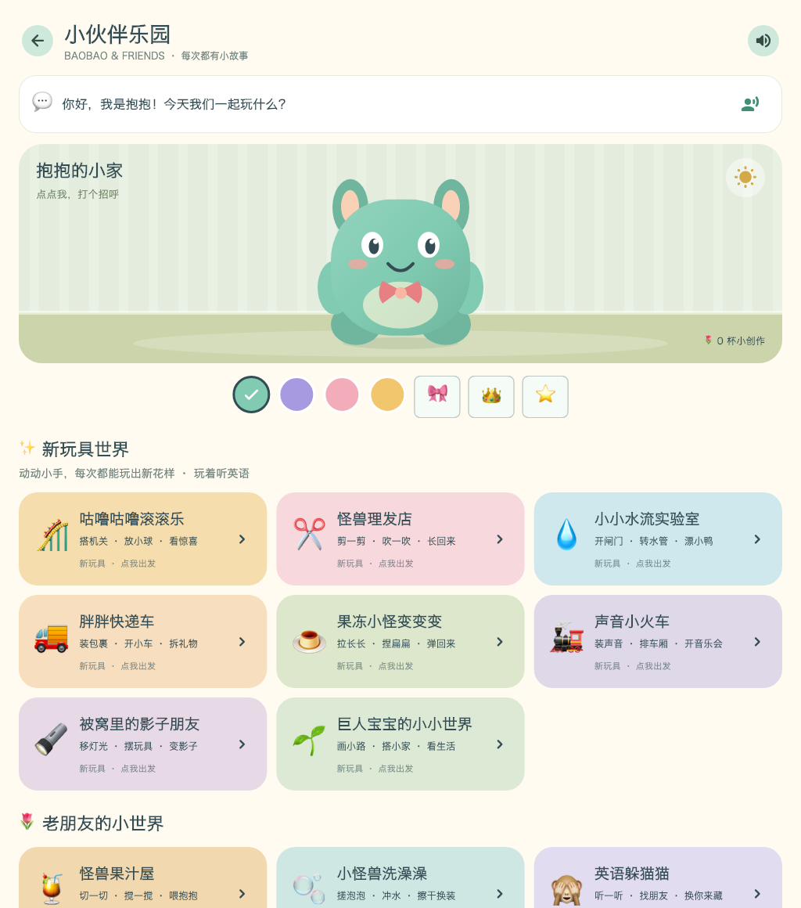

| 怪兽果汁屋 | 小怪兽洗澡澡 | 英语躲猫猫 |
| --- | --- | --- |
| 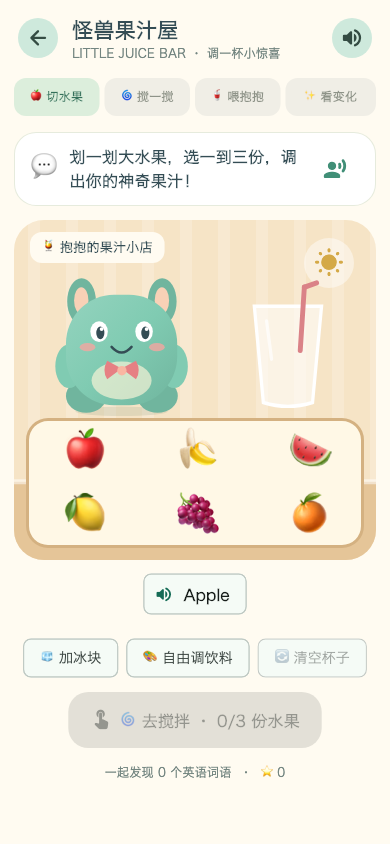 | 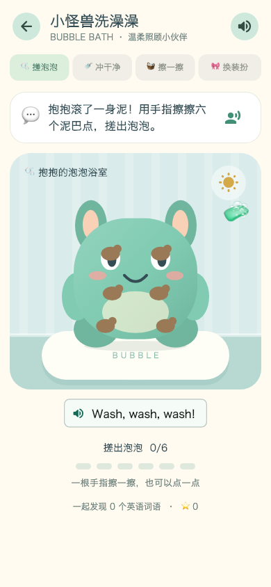 | 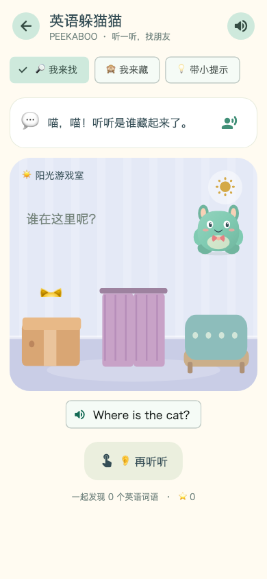 |

果汁屋可选 1–3 份水果，加入冰块后再搅拌。柠檬会让抱抱酸得眯眼，西瓜会带来小鱼肚肚，三种不同水果会变出彩虹胡子，加冰则飘出雪花。喝完的配方自动放进小家，点击配方即可再做一杯。每种反应只奖励首次发现，重玩仍可自由创作。

泡泡浴需要实际擦到不同身体部位。躲猫猫点错不扣分，可以继续寻找；「我来藏」模式由孩子选择位置，抱抱会依次打开藏身处。英文播放依赖设备已安装的系统英语语音；即使静音，所有玩法仍可通过图片与触摸完成。

| 天气工厂 | 恐龙托儿所 | 软糖建筑师 |
| --- | --- | --- |
| 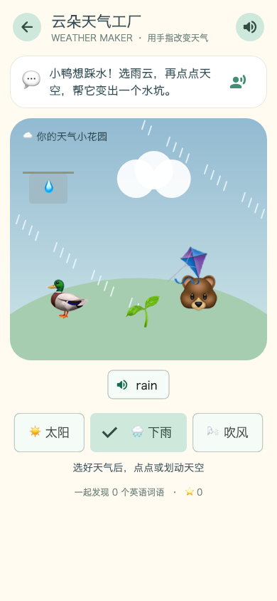 | 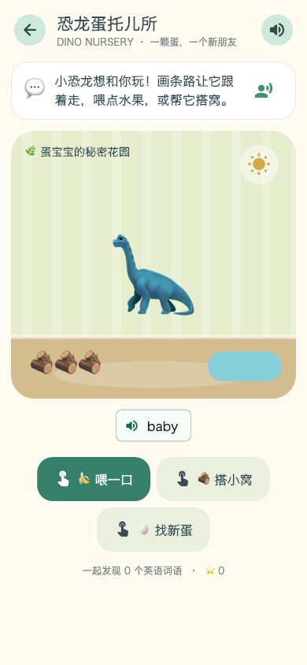 | 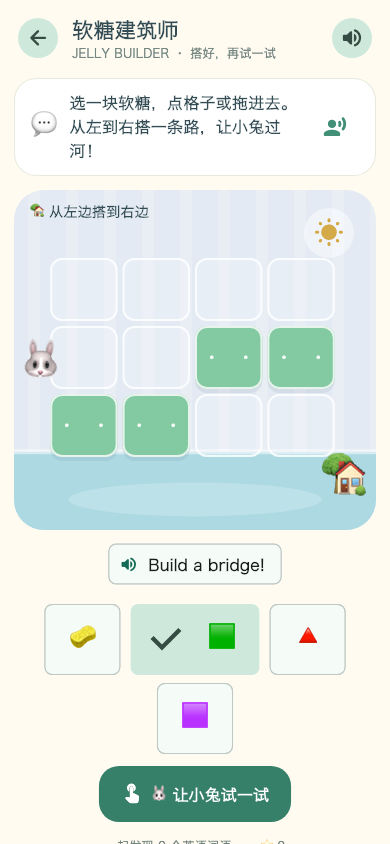 |

| 小笨怪学生活 | 动物动作剧场 | 星光烟花工坊 |
| --- | --- | --- |
| 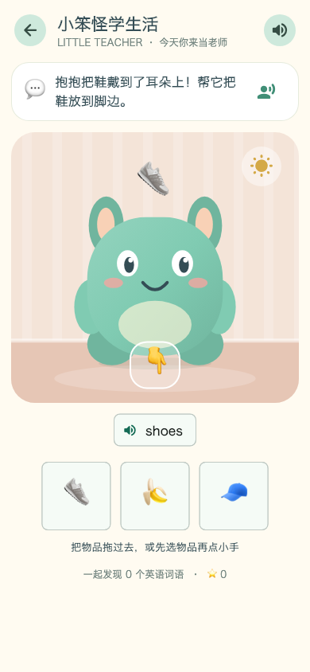 | 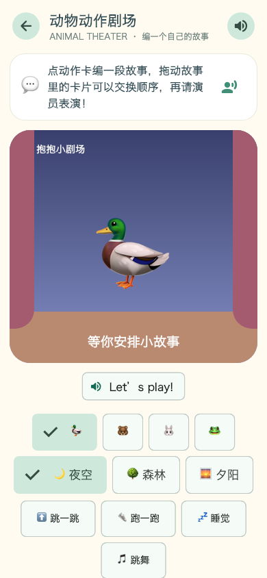 | 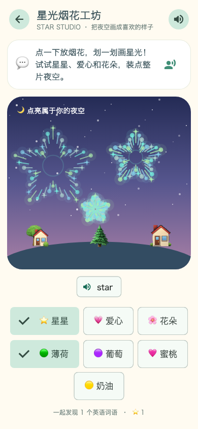 |

搭桥设计、动物短剧和恐龙小窝也会自动保存在本机。开启表演或试走软糖桥时，画面会自动回到舞台，方便小屏幕上的孩子观察结果。

## 🦕 抱抱探险队 · 河谷样章

这是一个独立的**连续冒险样章**，入口在「彩虹小岛 → 小伙伴乐园」的第一张大卡片。不是完整恐龙岛，也不替换原有小游戏。

### 第一次怎么玩

1. **开车出门**：按住车前方的道路向右开，松手停；轻点道路也能缓慢驶到目标处。点车身按喇叭。
2. **玩泥水坑**：轮胎带起水花，车身会沾泥。停在营地附近的小清水处可以洗掉泥点；小叶子、回声洞和能推着滚动的果子也可探索。
3. **吊木搭桥**：车在河边安全停下。拖动吊钩接近木头抓起，再拖向河面，靠近两岸会柔和吸附。也支持「点木头 → 点桥位」；放错可重新拿起，取消操作不会丢木头。
4. **邀请伙伴**：桥搭好，小恐龙会走过来。停稳后点小恐龙，邀请它上车。
5. **一起回家**：按住左侧道路回营地，小恐龙下车并留下。之后可以继续摆弄场景，也可再邀请它出游。

不设倒计时、生命值、答题或强制跟读。短英文在动作中出现，例如 **“Let’s go!” “Up!” “Come with me!” “We’re home!”**；点底部语音条可听当前操作帮助和英文。全局静音后仍可完整游玩。

### 画面与动画

原创纸艺绘本插画使用 16 张分层透明素材：远山、林木、草叶、帐篷、木纹、车辆、独立车轮/吊臂和恐龙头身腿尾。运行时做车轮滚动、地形俯仰、悬挂回弹、关节吊臂、绳索、泥水粒子、恐龙步态和上下车，不使用 emoji 作为场景主角。

| 吊木搭桥 | 新朋友回家 |
| --- | --- |
| 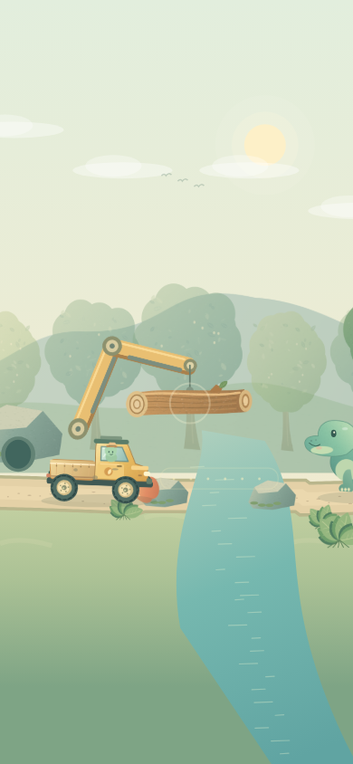 | 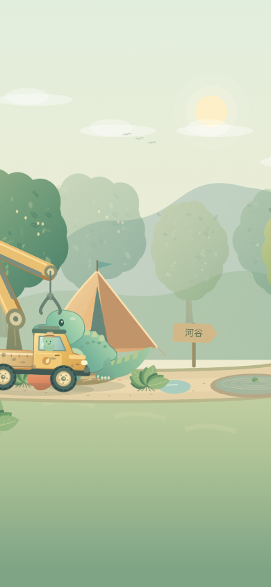 |

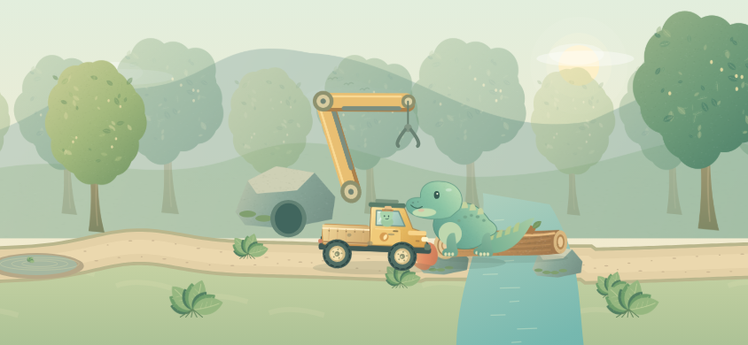

场景没有独立滚动工具区，竖屏保持近景，横屏看到更多河谷；吊装时固定镜头，绘制和触摸使用同一坐标变换。支持触摸取消、第二指保护、暂停、后台恢复和减少动态效果。

### 样章存档与验证

单独的版本化检查点保存桥、伙伴关系、营地变化、车辆安全位置、果子和发现；不保存瞬时速度/抓钩摆动。拖着木头退出时恢复安全河岸位置，其他小游戏的存档不受影响。测试专用入口使用内存进度，正常 `lib/main.dart` 使用本机持久化。

```bash
# 原创插画与音效源稿；可重复导出，不需要图像生成服务
flutter test tool/expedition_art/export_test.dart
python3 tool/expedition_art/audio.py

# 实际手势驱动的手机/横屏截图及回放帧
flutter test tool/expedition_capture_test.dart --update-goldens
ffmpeg -y -framerate 7.575757 -i build/expedition-replay/frame-%04d.png \
  -c:v libx264 -pix_fmt yuv420p -crf 20 -movflags +faststart \
  build/expedition-replay/river-valley.mp4

# 实际 macOS 应用：原始指针走完整段流程，逐步断言结果
flutter drive -d macos --target=tool/expedition_driver_app.dart \
  --driver=tool/expedition_driver_test.dart
```

回放 `build/expedition-replay/river-valley.mp4` 来自 Widget 测试实际手势驱动的场景渲染，**不是 iPhone 真机录屏，也不用于证明实际帧率**。原生截图在 `build/expedition-native/`。原生烟雾测试的专用入口在指针回放阶段隔离外部鼠标与窗口焦点事件，并发送前台生命周期事件以避免桌面操作干扰；正常游戏入口不作这些修改，后台取消由独立测试覆盖。iOS 工程保留原有 Unity 真机目标配置；真机可连接时应继续验证触摸与 profile 性能，本次不以桌面或跨屏测试冒充 iPhone 原生验证。

## 🧸 八个新玩具世界

在「彩虹小岛 → 小伙伴乐园 → 新玩具世界」进入。八款游戏都不设倒计时、失败扣分或必须跟读的考试；一根手指就能探索，主要拖动操作也有点选替代。手机上场景固定在上方、工具区可独立滚动，宽屏则并排显示。

| 新玩具 | 第一次可以这样玩 | 英语例子 |
| --- | --- | --- |
| 🎢 **咕噜咕噜滚滚乐** | 选机关后点轨道圆圈，再放球；跳床、变大洞、鸭子洞、岔路和铃铛会真实影响球。大球卡住时点「打喷嚏」救出。三种滑道、三种小球，可同时滚动最多五颗球。 | ball / big / up / down；“Roll the ball!” |
| ✂️ **怪兽理发店** | 划过头发局部剪短，用梳子改变方向、吹风机吹歪、生发泡泡长回来，再染色、戴装饰、照镜子。三位客人的发型分别保留。 | cut / comb / blow / long / bow；“I love my hair!” |
| 💧 **小小水流实验室** | 开水，旋转三段水管直到接通，等水槽变满再拔塞子。流水驱动水车、装满翻桶，把小鸭送下滑梯；关闸或断管会改变下游供水。 | water / open / close / full / empty；“Let it flow!” |
| 🚚 **胖胖快递车** | 给门牌上的朋友装包裹，按住开车或点自动驾驶，途中洗车、坐渡船、开合桥，最后投递拆礼物。三位朋友家的围巾、弹跳枕和雪花机可以反复回访游玩。 | box / car / boat / bridge / gift；“Here is your box!” |
| 🍮 **果冻小怪变变变** | 拉边缘、压肚子，松手看局部弹性回弹。羽毛逗笑、扇子吹歪、弹簧垫弹跳；还能拖五官、盖表情印章、换果冻色。 | stretch / squeeze / bounce / happy / sleepy |
| 🚂 **声音小火车** | 把青蛙、小鼓、小猫和铃铛装入 2–6 节车厢，拖动换序或点编号交换。车厢经过音乐门才按顺序发声，可换速度、山洞回声和月夜场景。 | frog / drum / bell / fast / slow；“All aboard!” |
| 🔦 **被窝里的影子朋友** | 拖动手电或玩具，观察影子的方向和大小；摆小兔、小熊、香蕉、帽子，叠放组合，再开灯看真相。三种温暖帐篷，不含惊吓。 | light / shadow / big / small / moon；“Move the light!” |
| 🌱 **巨人宝宝的小小世界** | 划路、压池塘，放叶子棚、铅笔桥、茶杯屋、饼干、花朵和休息垫。桥真正改变河流两岸的可达性，小动物会走路、取食、回家、避雨。物品可以移动与收回。 | road / leaf / bridge / house / cookie；“Thank you for the house!” |

### 玩法画面

| 滚滚乐 | 怪兽理发店 |
| --- | --- |
| 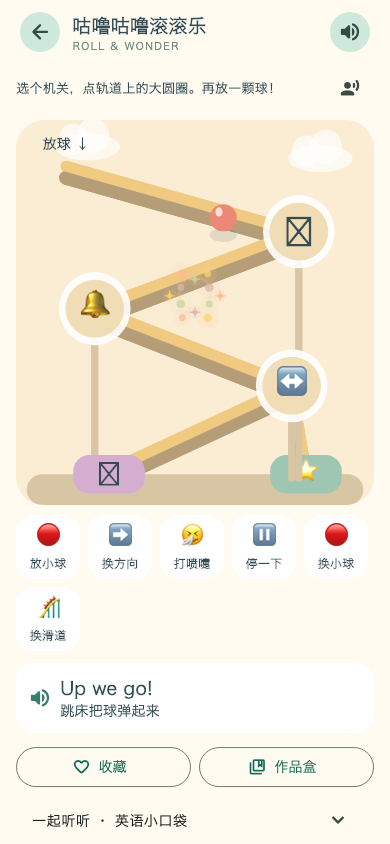 | 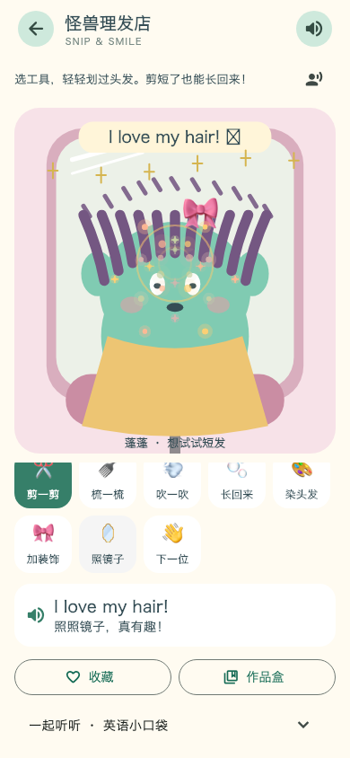 |

| 水流实验室 | 胖胖快递车 |
| --- | --- |
| 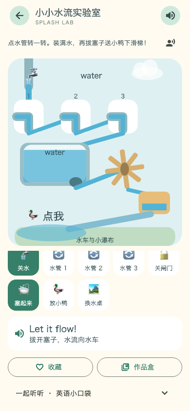 | 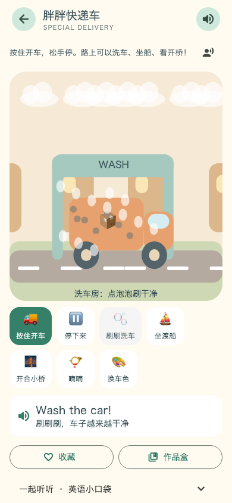 |

| 果冻小怪 | 声音小火车 |
| --- | --- |
| 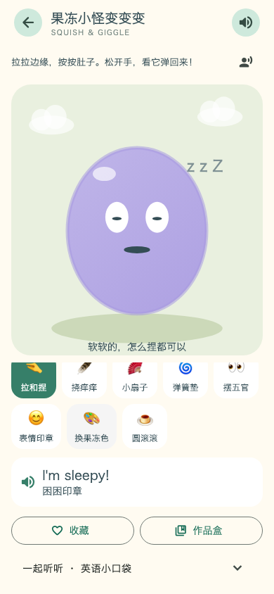 | 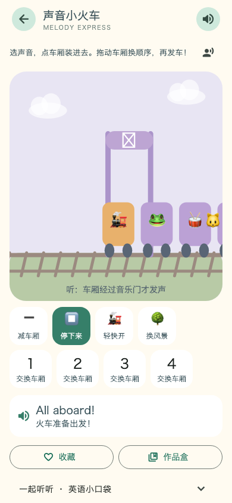 |

| 影子朋友 | 小小世界 |
| --- | --- |
| 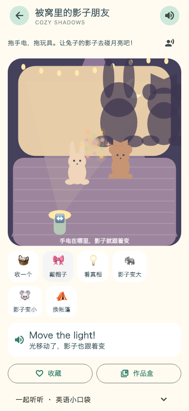 | 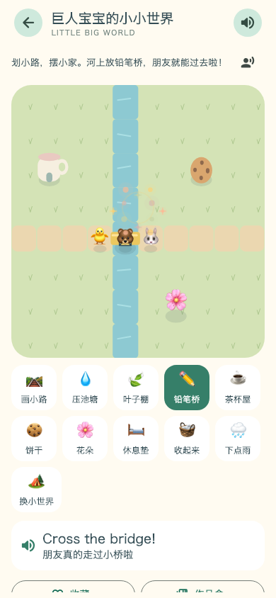 |

### 玩着听英语

- 中文短提示帮助理解操作，英文词语或简短句子在动作、物品与结果出现时自然播放；英文使用独立的系统英语音色，不使用中文音色读英文。
- 自动播报有冷却、同词去重和完成/取消管理，快速划动不会逐帧打断朗读。点击英文卡片可重听；展开「英语小口袋」可点图标听词义对应的英文。
- 总声音开关控制语音与音效，关闭声音也能完成所有玩法。词语收藏代表游戏中接触过的内容，不代表孩子已掌握，也不把静音操作当作已听到声音。
- 九种新增短音效由 `tool/generate_play_audio.py` 原创合成并内置。火车的动物声音是玩具风格的合成拟声，不是动物实录。
- 发音依赖设备可用的英语系统语音；建议首次亲子试玩时确认音量及设备语音资源。游戏本身不请求麦克风、不做发音评分、不需要联网。

### 作品、重玩与保存

每款自动保存最近的稳定设计或完成状态，并有独立的「作品盒」：点击爱心可收藏最多 **6 个不同作品**，带实际场景缩略图，点开即可恢复继续修改。滑道设计、三位客人发型、水管布局、已投递礼物、果冻五官、火车音序、影子场景和微缩世界都会保留。

运行中的小球、临时水位、驾驶位置等不逐帧存盘；重新进入会从稳定状态继续。进入后台会暂停模拟或停止驾驶/发车，不自动跳过一大段过程。换场景有确认，已收藏作品不会一并清除。发现奖励使用去重标记；重玩仍保留互动反馈。

新玩具日志与旧配方、旧游戏进度兼容，按玩法验证版本、枚举、坐标和容量。单款损坏数据回退，不清空其他游戏的记录。

### 开发验证

```bash
flutter analyze
flutter test

# 原创短音效的可复现生成
python3 tool/generate_play_audio.py

# 手机与宽屏渲染截图（此脚本加载 macOS 系统字体）
flutter test tool/play_screenshot_test.dart --update-goldens

# 真实 macOS 应用烟雾测试：从实验室打开地图，再逐款操作、收藏、返回
flutter drive -d macos --target=tool/play_driver_app.dart --driver=tool/play_driver_test.dart

# iPhone/iPad 设备或模拟器：替换设备 ID
PLAY_SMOKE_DIR=build/play-ios-smoke flutter drive -d <device-id> \
  --target=tool/play_driver_app.dart --driver=tool/play_driver_test.dart
```

当前 iOS 工程集成的 Unity 目标仅提供 `iphoneos` 真机目的地；如果 Xcode 报模拟器目标不可用，需要使用已配置签名的真机验证，不能将跨屏 Widget 测试等同于 iOS 原生测试。本次未改动既有 Unity 集成。

原生烟雾入口运行实际 `ColorHugApp` 与实际语音/音效，游戏进度使用内存实例，避免覆盖孩子的本机作品。截图默认放在 `build/play-native-smoke/`。自动测试覆盖模型因果关系、实际手势、八款存档往返与损坏恢复、原生语音完成/取消、静音、后台恢复、横竖屏和放大字体。

## 🧪 两种混色模式

| 模式 | 混色方式 | 示例 |
| --- | --- | --- |
| ☀️ 光 | 加色混合，颜色相遇后变得更亮 | 红光 + 绿光 → 黄光；绿光 + 白光 → 白光 |
| 🖌️ 颜料 | 经典配方结合减色混合近似，混色不再是简单 RGB 平均 | 红色 + 黄色 → 橙色；绿色 + 白色 → 浅绿色 |

> 白光已包含可见光的各种色光，所以它与绿光叠加仍接近白色；白色颜料则会把绿色颜料调浅。游戏会用语音讲出这个区别。

## 🎮 怎么玩

1. 点击实验室顶部的地图按钮进入彩虹小岛。
2. 在实验室、色彩侦探、彩虹修复师、魔法画室和奥特曼训练营之间自由选择。
3. 跟着彩虹精灵的语音提示操作；没听清时，点击带有人物声波的按钮再听一次。
4. 完成线索与修复任务收集星星，混色和绘画则会解锁更多颜色。
5. 打开色彩图鉴，点击卡片听一听已经发现的颜色和它们的小秘密。

在水果切切乐中，用一根手指划过画面中央的练习西瓜即可开始。之后水果会缓慢从训练场中飞出；漏掉不会扣分，收集到本关目标数量就能获得一颗星星并解锁下一关。顶部的关卡按钮可以重玩已经解锁的 30 个关卡。

## 🚀 快速开始

### 环境要求

- Flutter SDK（Dart `>= 3.12.2`）
- 构建 macOS 或 iOS 版本时需要 Xcode

### 在 macOS 上运行

```bash
flutter pub get
flutter run -d macos
```

### 在 iPhone 或 iPad 上运行

连接已解锁并开启开发者模式的真机，然后选择设备运行：

```bash
flutter devices
flutter run -d <device-id>
```

## ✅ 验证

```bash
flutter analyze
flutter test
flutter build macos
flutter build ios --debug --no-codesign
```

## 🗂️ 项目结构

```text
lib/
├── main.dart                    # 应用入口、主题与共享进度
├── rainbow_island_screen.dart   # 彩虹小岛活动地图
├── color_lab_screen.dart        # 混色实验室、交互与动画
├── color_detective_screen.dart  # 色彩侦探线索游戏
├── rainbow_repair_screen.dart   # 彩虹花园修复关卡
├── rainbow_repair_levels.dart   # 20 张地图与 100 个修复任务
├── magic_studio_screen.dart     # 自由绘画画室
├── color_gallery_screen.dart    # 色彩图鉴
├── ultraman_training_camp_screen.dart # 奥特曼训练营与五种玩法入口
├── monster_planet_game.dart     # 角色选择与非 iOS 的 Flame 2D 兼容战斗
├── monster_planet_3d_screen.dart # iPhone 全屏 Unity 3D 容器与消息桥
├── light_guardian_screen.dart   # 奥特曼互补色能量护盾
├── ultra_assets.dart            # 奥特曼图片素材组件
├── game_audio.dart              # 中文语音、音效与声音开关
├── island_progress.dart         # 星星、作品与颜色发现
├── color_mixer.dart             # 光与颜料的混色规则
└── color_challenges.dart        # 颜色任务与目标

test/
├── widget_test.dart             # 实验室交互与响应式布局
├── island_features_test.dart    # 彩虹小岛与新玩法流程
├── game_audio_test.dart         # 语音与音效控制逻辑
├── island_progress_test.dart    # 共享奖励与发现进度
├── fruit_slice_game_test.dart   # 划动命中、30 关配置与水果音效映射
├── color_mixer_test.dart        # 混色规则
└── color_challenges_test.dart   # 任务题库

assets/audio/                    # 点击、答题、发现与完成提示音
assets/fruit_game/               # 水果精灵图与训练场背景
assets/ultra/                    # 离线角色、怪兽、星球背景、技能特效与救援素材
```

## 🎨 素材说明

奥特曼训练营使用为本项目生成的本地游戏插画，不包含影视截图、视频或第三方音频。“奥特曼”名称及相关角色权利归原权利人所有，该部分仅用于家庭本地娱乐与学习。

## 📄 许可证

本项目基于 [MIT License](LICENSE) 开源。
