<div align="center">

# 🌈 颜色抱抱

**探索、观察、创作，在彩虹小岛发现颜色的秘密。**

一个为孩子设计的互动色彩游戏。孩子可以混合颜色、破解线索、完成守护任务、修复花园、自由绘画，并收藏自己的色彩发现。

<p>
  
  
  
  
  
  <a href="LICENSE"></a>
</p>

[玩法亮点](#-玩法亮点) · [界面预览](#-界面预览) · [快速开始](#-快速开始) · [项目结构](#-项目结构)

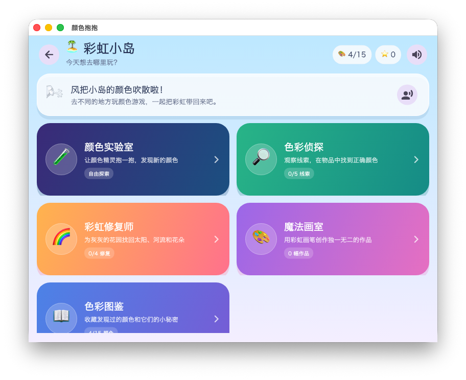

<sub>macOS · 彩虹小岛活动地图</sub>

</div>

## ✨ 玩法亮点

- **彩虹小岛**：六个活动共享星星、作品和颜色发现，让每次游玩都有积累。
- **颜色实验室**：从 24 色面板选择颜色精灵，分别探索光和颜料的混色规律。
- **100 道颜色任务**：50 道光色挑战与 50 道颜料挑战，包含故事、干扰色和三档难度。
- **色彩侦探**：根据生活化线索观察物品，从不同答案中找出正确颜色。
- **彩虹修复师**：挑战 100 个可选关卡，在 20 张主题地图中用点击、拖拽、听声与混色玩法探索 16 种颜色。
- **魔法画室**：选择颜色和画笔粗细自由绘画，完成后记录自己的创作次数。
- **色彩图鉴**：点亮 26 张收藏卡片，阅读颜色配方和有趣的小秘密。
- **水果切切乐**：为三岁儿童设计的一指玩法，拥有 30 个可选择关卡、清脆实录切果音效、果汁画、连切慢动作和彩虹能量果，漏掉水果也不扣分。
- **奥特曼训练营**：水果切切乐、怪兽雷达、光线发射、宇宙救援和能量护盾五种玩法，共 58 个独立进度。
- **素材化游戏画面**：高清奥特曼立绘、可爱怪兽、月球基地与救援场景全部内置，无需联网。
- **语音陪玩**：进入玩法会主动用中文讲解步骤，关键操作也会说出鼓励或下一步提示，不识字也能独立探索。
- **声音反馈**：点击扬声器可以重复收听；点击、答对、再试、发现和完成都有不同音效，总声音开关会记住设置。
- **自动保存成长**：星星、图鉴、修复进度和作品数量会保存在本机，下次打开可以继续。
- **充满即时反馈**：磁吸、呼吸动画、表情、触觉和庆祝效果，让每次探索都有回应。
- **一套代码，多种屏幕**：界面会适配 macOS、iPad 与 iPhone 的不同尺寸。
- **低龄友好操作**：核心训练不用摇杆和组合按键，孩子只需点击或用一根手指滑动。

## 🖼️ 界面预览

### 颜色实验室

<table>
  <tr>
    <td width="50%" align="center">
      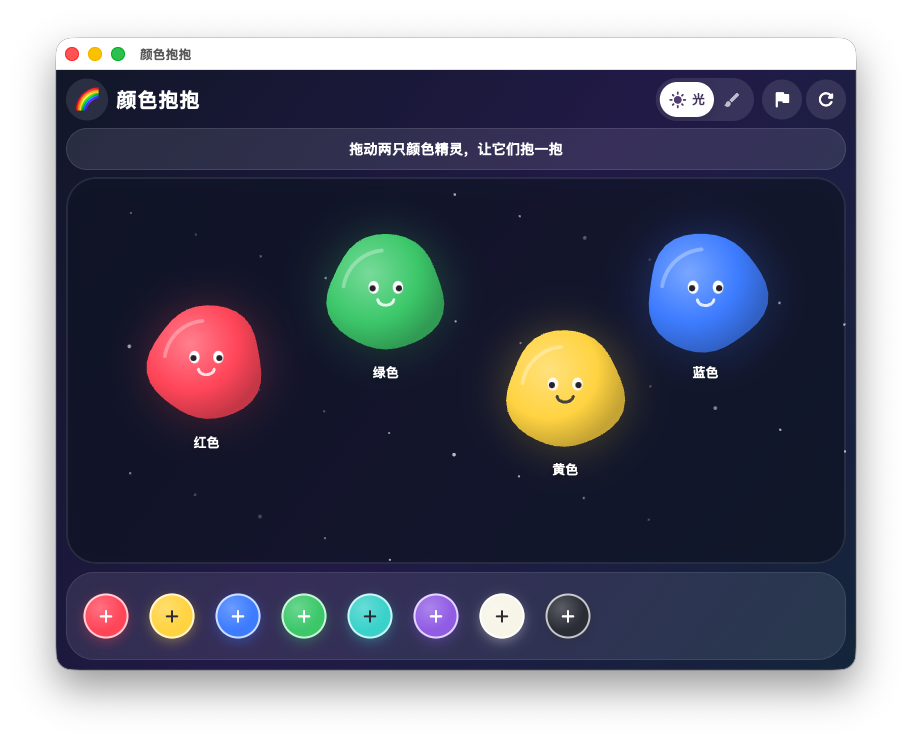
    </td>
    <td width="50%" align="center">
      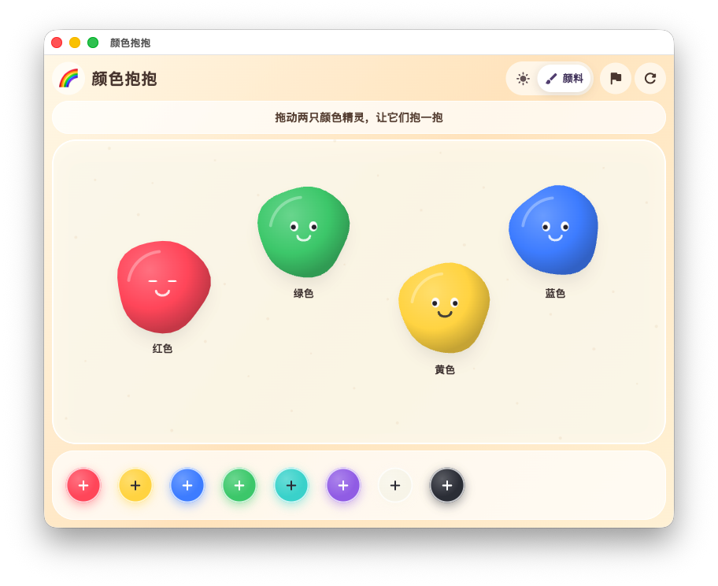
    </td>
  </tr>
  <tr>
    <td align="center"><strong>☀️ 光模式</strong><br><sub>拖动颜色精灵探索加色混合</sub></td>
    <td align="center"><strong>🎨 颜料模式</strong><br><sub>在温暖的画布上探索颜料混色</sub></td>
  </tr>
</table>

<table>
  <tr>
    <td width="50%" align="center">
      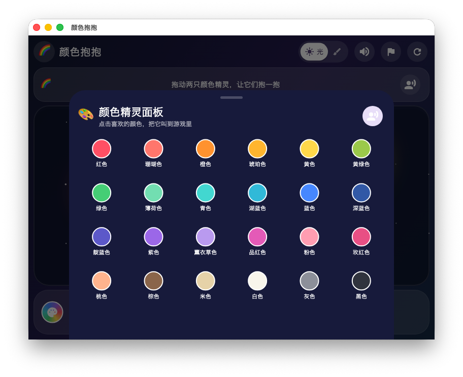
    </td>
    <td width="50%" align="center">
      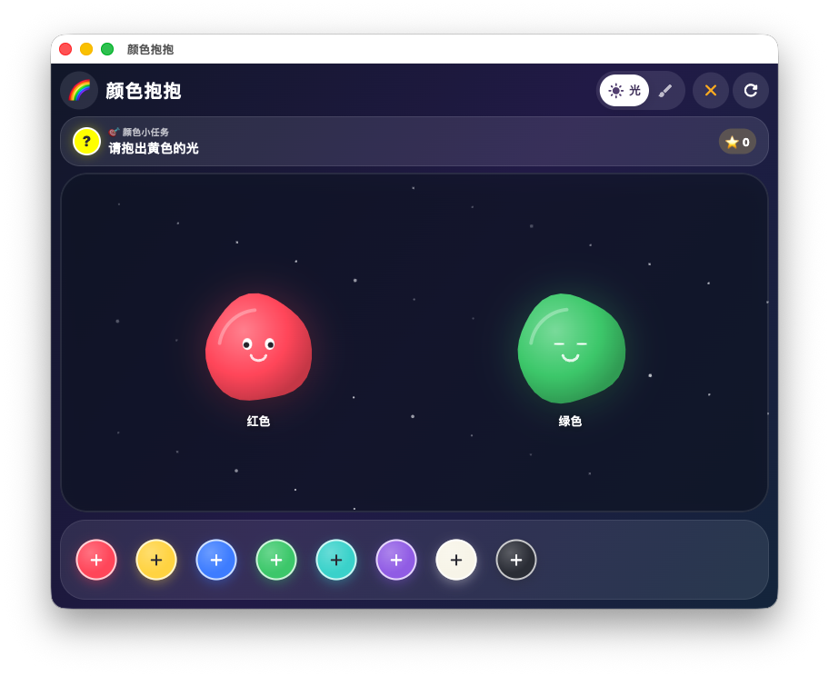
    </td>
  </tr>
  <tr>
    <td align="center"><strong>🎨 24 色精灵面板</strong><br><sub>点击任意颜色，把新的颜色精灵叫进游戏</sub></td>
    <td align="center"><strong>🚩 100 道颜色任务</strong><br><sub>辨别正确配方与干扰色，完成挑战收集星星</sub></td>
  </tr>
</table>

### 彩虹小岛玩法

<table>
  <tr>
    <td width="50%" align="center">
      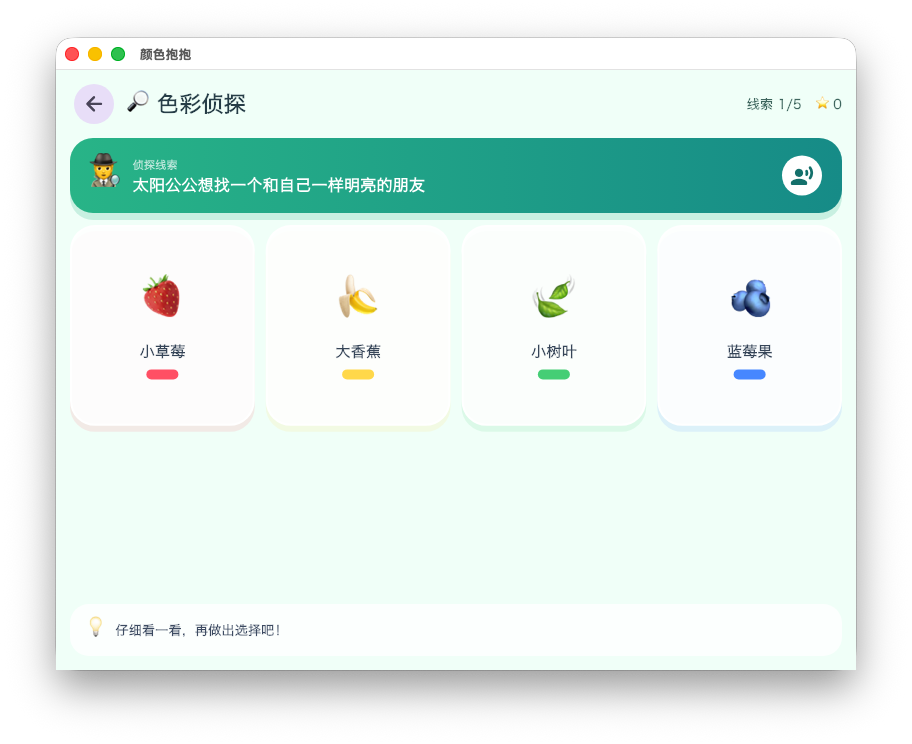
    </td>
    <td width="50%" align="center">
      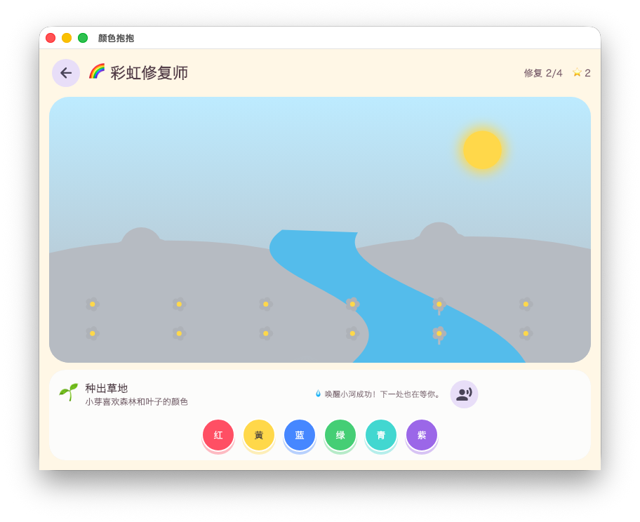
    </td>
  </tr>
  <tr>
    <td align="center"><strong>🔎 色彩侦探</strong><br><sub>听线索、观察物品，找出正确颜色</sub></td>
    <td align="center"><strong>🌈 彩虹修复师</strong><br><sub>用颜色逐步唤醒太阳、河流与花园</sub></td>
  </tr>
  <tr>
    <td width="50%" align="center">
      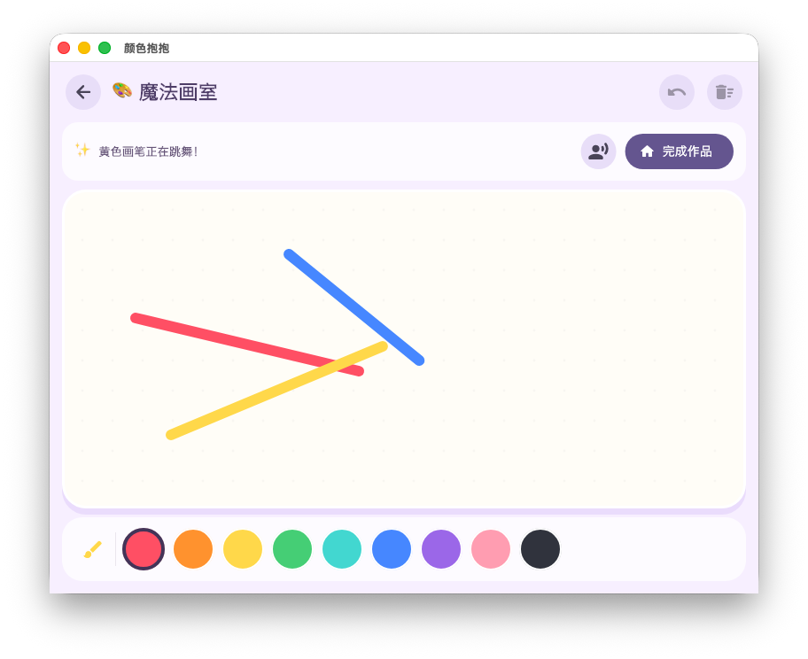
    </td>
    <td width="50%" align="center">
      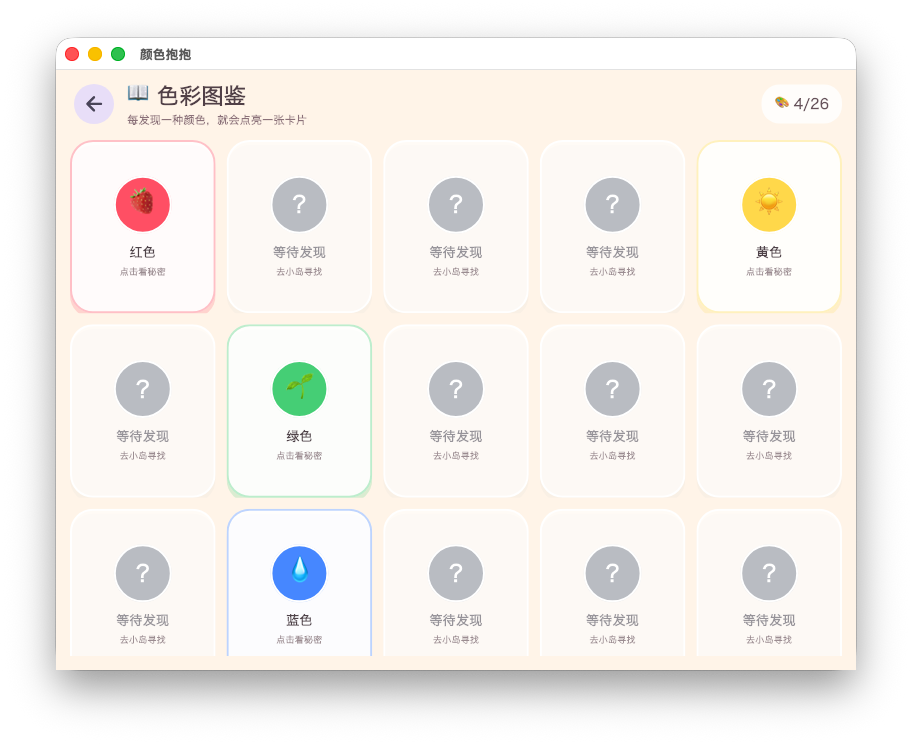
    </td>
  </tr>
  <tr>
    <td align="center"><strong>🎨 魔法画室</strong><br><sub>挑选彩虹画笔，自由创作自己的作品</sub></td>
    <td align="center"><strong>📖 色彩图鉴</strong><br><sub>点亮颜色卡片，聆听每种颜色的小秘密</sub></td>
  </tr>
</table>

### 奥特曼训练营

<p align="center">
  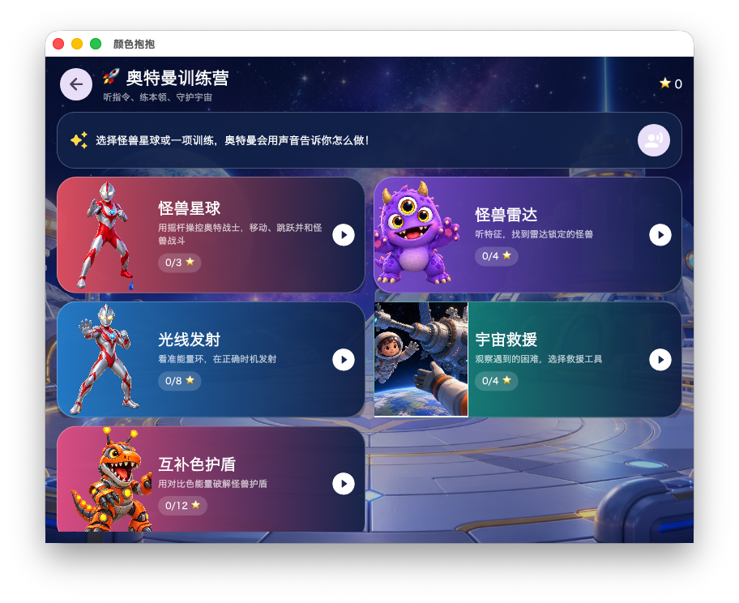
  <br>
  <strong>🚀 五种守护宇宙的本领</strong><br>
  <sub>每个玩法都有中文语音指令、大图标和独立进度</sub>
</p>

<p align="center">
  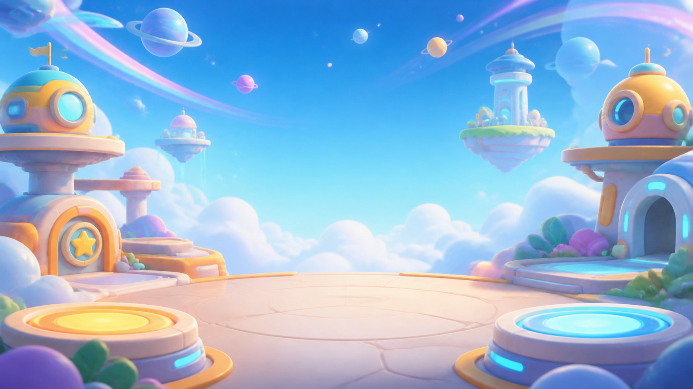
  <br>
  <strong>🍉 水果切切乐</strong><br>
  <sub>一根手指划过大水果，漏掉不扣分，没有炸弹和失败惩罚</sub>
</p>

<table>
  <tr>
    <td width="50%" align="center">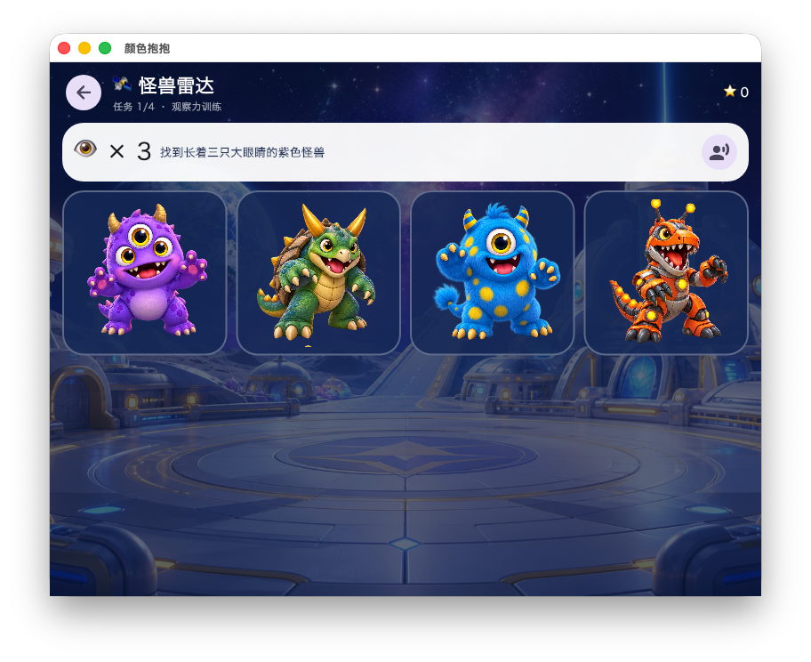</td>
    <td width="50%" align="center">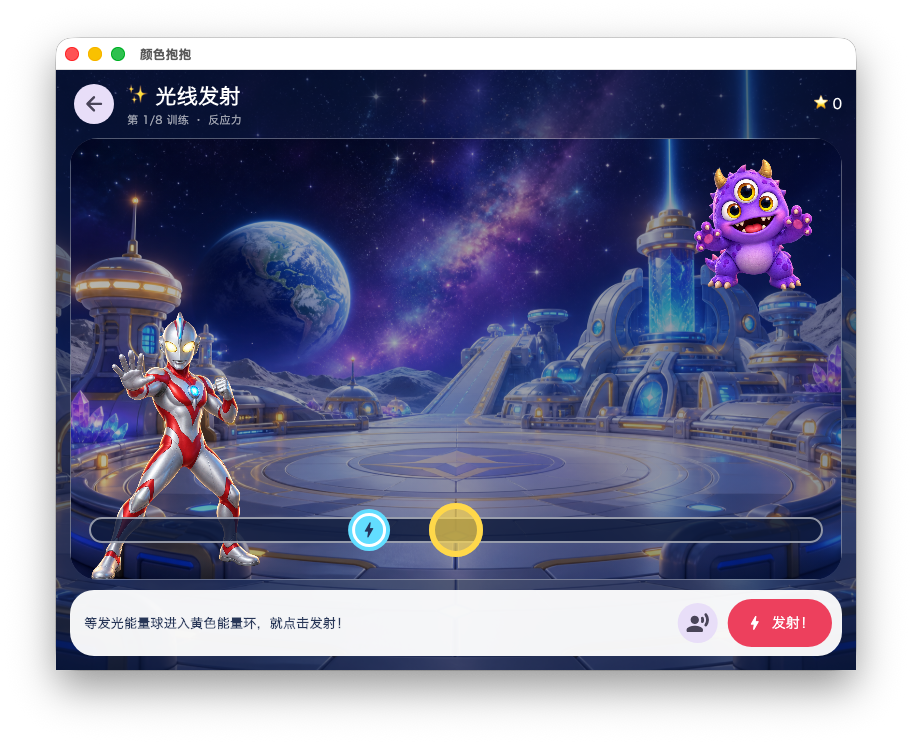</td>
  </tr>
  <tr>
    <td align="center"><strong>🛰️ 怪兽雷达</strong><br><sub>听眼睛、角、斑点等特征，找出雷达目标</sub></td>
    <td align="center"><strong>✨ 光线发射</strong><br><sub>观察移动能量球，看准时机发射光线</sub></td>
  </tr>
  <tr>
    <td width="50%" align="center">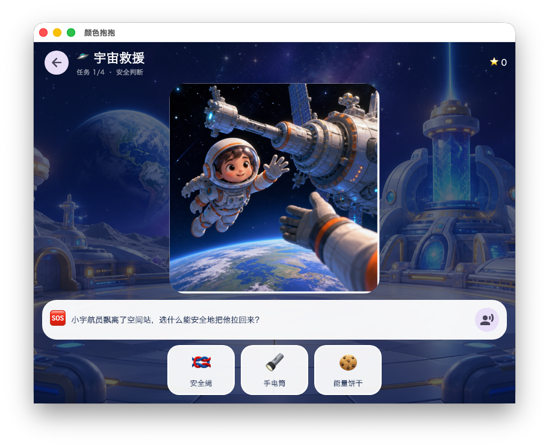</td>
    <td width="50%" align="center">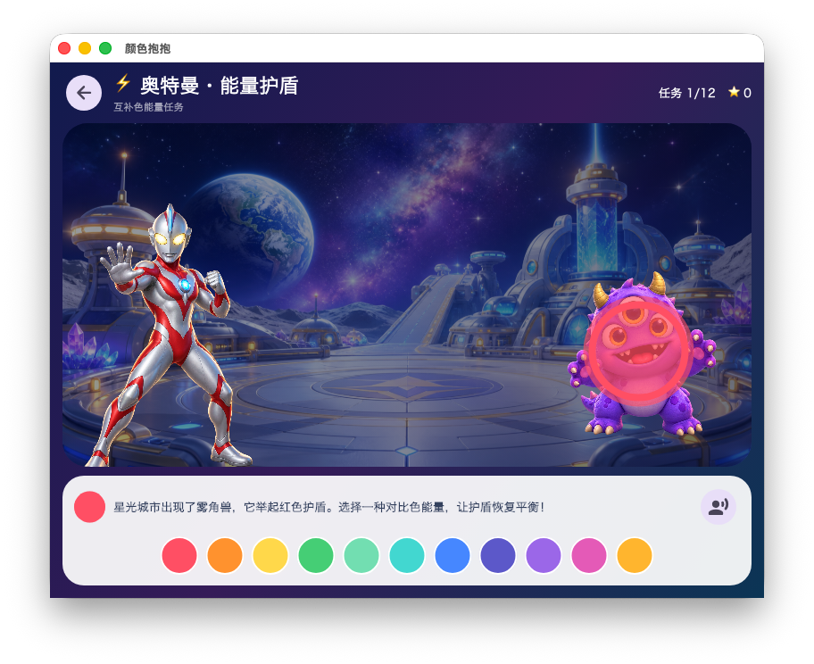</td>
  </tr>
  <tr>
    <td align="center"><strong>🛸 宇宙救援</strong><br><sub>从安全绳、灭火器、急救箱等工具中做出判断</sub></td>
    <td align="center"><strong>⚡ 能量护盾</strong><br><sub>使用互补色能量破解怪兽护盾</sub></td>
  </tr>
</table>

## 🧪 两种混色模式

| 模式 | 混色方式 | 示例 |
| --- | --- | --- |
| ☀️ 光 | 加色混合，颜色相遇后变得更亮 | 红光 + 绿光 → 黄光；绿光 + 白光 → 白光 |
| 🖌️ 颜料 | 经典配方结合减色混合近似，混色不再是简单 RGB 平均 | 红色 + 黄色 → 橙色；绿色 + 白色 → 浅绿色 |

> 白光已包含可见光的各种色光，所以它与绿光叠加仍接近白色；白色颜料则会把绿色颜料调浅。游戏会用语音讲出这个区别。

## 🎮 怎么玩

1. 点击实验室顶部的地图按钮进入彩虹小岛。
2. 在实验室、色彩侦探、彩虹修复师、魔法画室和奥特曼训练营之间自由选择。
3. 跟着彩虹精灵的语音提示操作；没听清时，点击带有人物声波的按钮再听一次。
4. 完成线索与修复任务收集星星，混色和绘画则会解锁更多颜色。
5. 打开色彩图鉴，点击卡片听一听已经发现的颜色和它们的小秘密。

在水果切切乐中，用一根手指划过画面中央的练习西瓜即可开始。之后水果会缓慢从训练场中飞出；漏掉不会扣分，收集到本关目标数量就能获得一颗星星并解锁下一关。顶部的关卡按钮可以重玩已经解锁的 30 个关卡。

## 🚀 快速开始

### 环境要求

- Flutter SDK（Dart `>= 3.12.2`）
- 构建 macOS 或 iOS 版本时需要 Xcode

### 在 macOS 上运行

```bash
flutter pub get
flutter run -d macos
```

### 在 iPhone 或 iPad 上运行

连接已解锁并开启开发者模式的真机，然后选择设备运行：

```bash
flutter devices
flutter run -d <device-id>
```

## ✅ 验证

```bash
flutter analyze
flutter test
flutter build macos
flutter build ios --debug --no-codesign
```

## 🗂️ 项目结构

```text
lib/
├── main.dart                    # 应用入口、主题与共享进度
├── rainbow_island_screen.dart   # 彩虹小岛活动地图
├── color_lab_screen.dart        # 混色实验室、交互与动画
├── color_detective_screen.dart  # 色彩侦探线索游戏
├── rainbow_repair_screen.dart   # 彩虹花园修复关卡
├── rainbow_repair_levels.dart   # 20 张地图与 100 个修复任务
├── magic_studio_screen.dart     # 自由绘画画室
├── color_gallery_screen.dart    # 色彩图鉴
├── ultraman_training_camp_screen.dart # 奥特曼训练营与五种玩法入口
├── monster_planet_game.dart     # 角色选择与非 iOS 的 Flame 2D 兼容战斗
├── monster_planet_3d_screen.dart # iPhone 全屏 Unity 3D 容器与消息桥
├── light_guardian_screen.dart   # 奥特曼互补色能量护盾
├── ultra_assets.dart            # 奥特曼图片素材组件
├── game_audio.dart              # 中文语音、音效与声音开关
├── island_progress.dart         # 星星、作品与颜色发现
├── color_mixer.dart             # 光与颜料的混色规则
└── color_challenges.dart        # 颜色任务与目标

test/
├── widget_test.dart             # 实验室交互与响应式布局
├── island_features_test.dart    # 彩虹小岛与新玩法流程
├── game_audio_test.dart         # 语音与音效控制逻辑
├── island_progress_test.dart    # 共享奖励与发现进度
├── fruit_slice_game_test.dart   # 划动命中、30 关配置与水果音效映射
├── color_mixer_test.dart        # 混色规则
└── color_challenges_test.dart   # 任务题库

assets/audio/                    # 点击、答题、发现与完成提示音
assets/fruit_game/               # 水果精灵图与训练场背景
assets/ultra/                    # 离线角色、怪兽、星球背景、技能特效与救援素材
```

## 🎨 素材说明

奥特曼训练营使用为本项目生成的本地游戏插画，不包含影视截图、视频或第三方音频。“奥特曼”名称及相关角色权利归原权利人所有，该部分仅用于家庭本地娱乐与学习。

## 📄 许可证

本项目基于 [MIT License](LICENSE) 开源。
