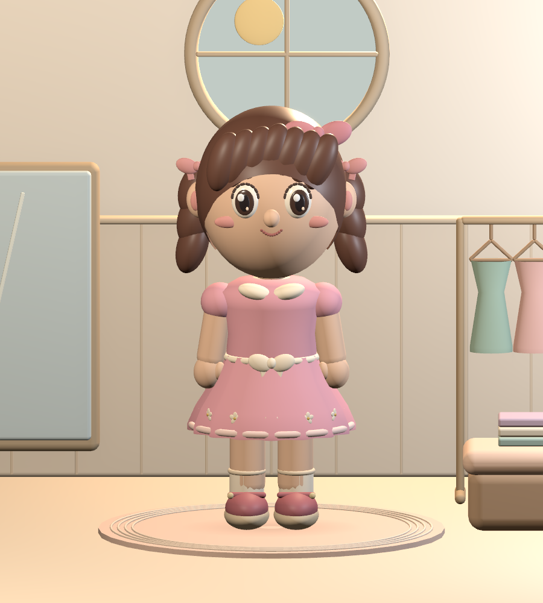
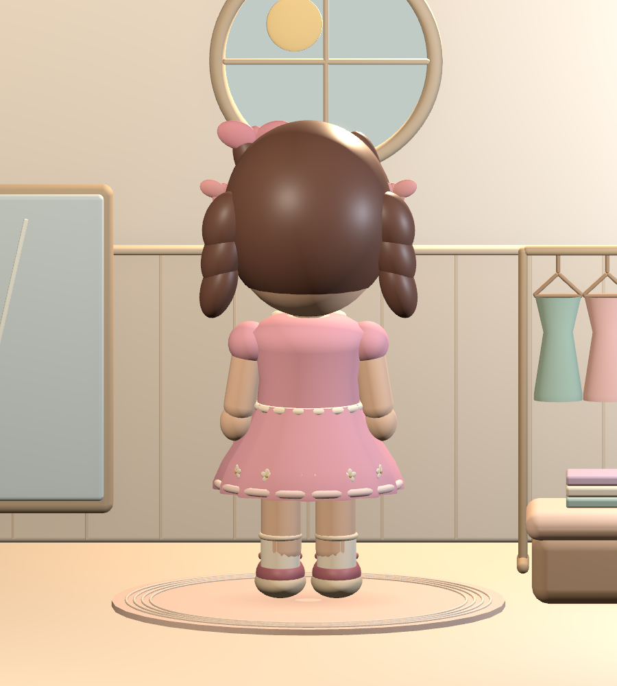
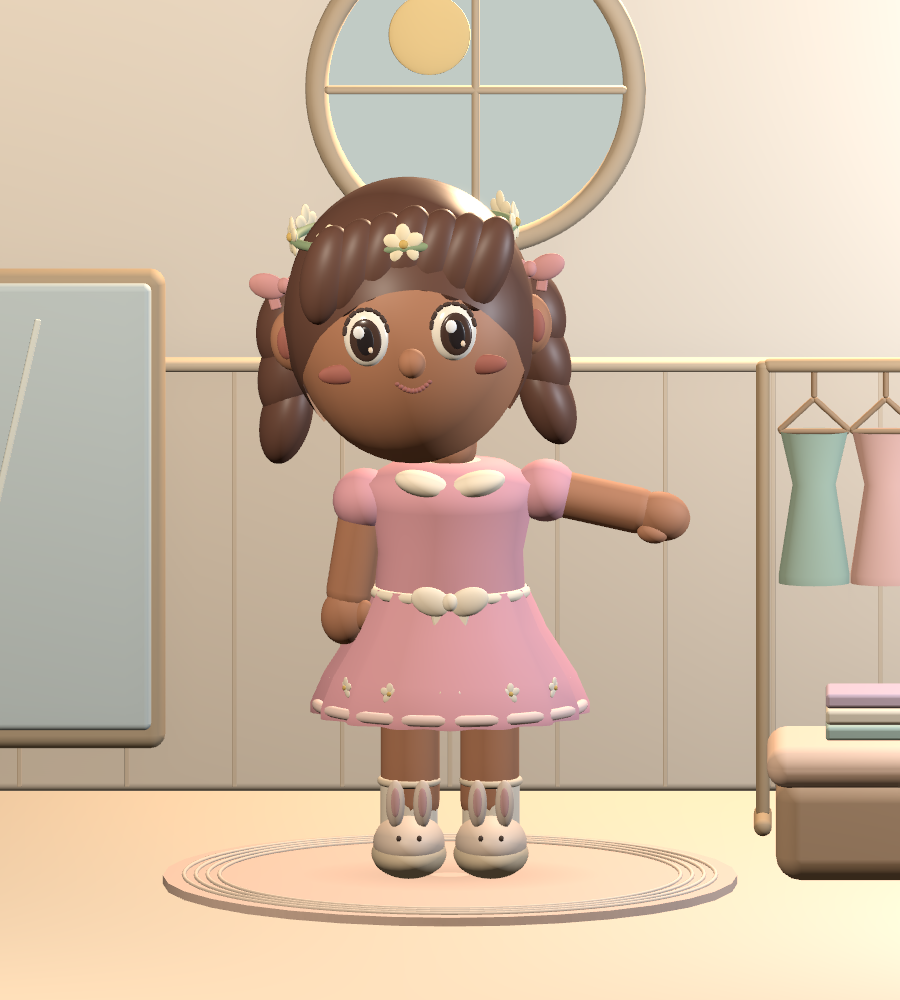
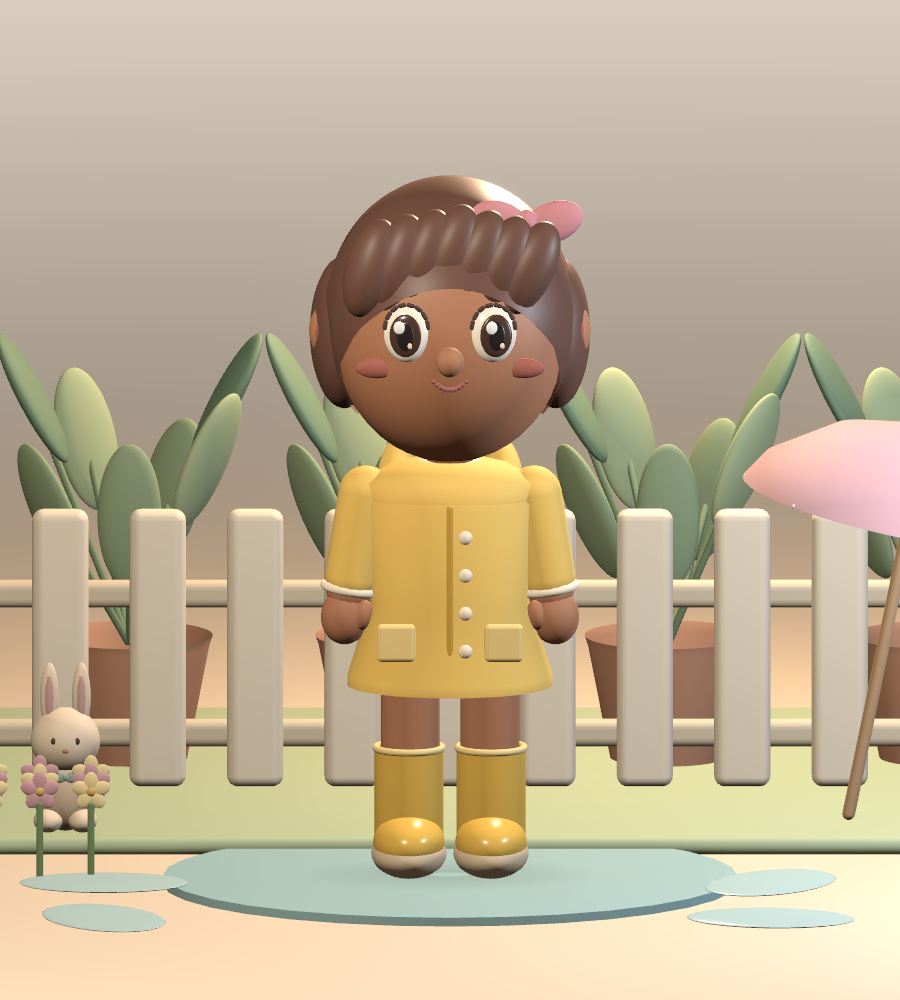
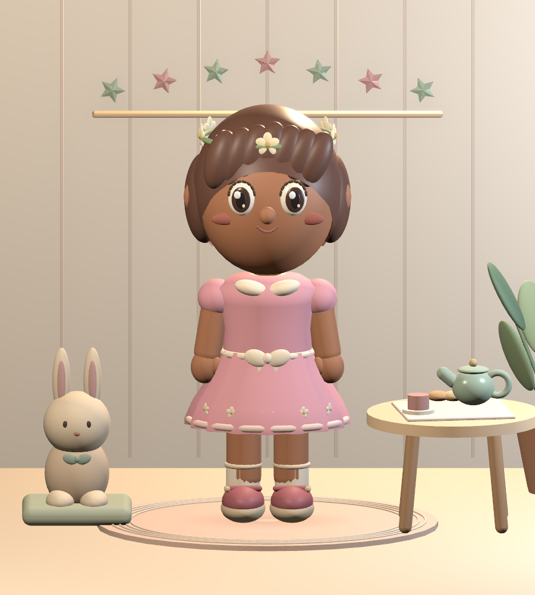
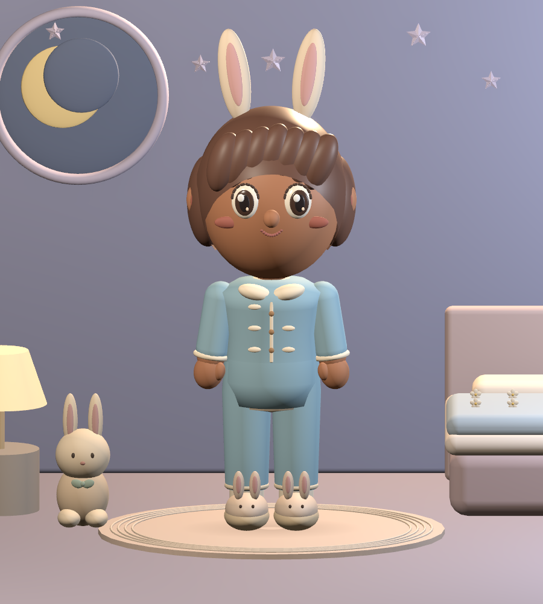

# 绒绒衣橱 · Little Wardrobe

面向约 3 岁儿童的离线 3D 换装游戏，作为 ColorHug 新首页。Flutter 负责衣橱、手势、相册与存档；iPhone、iPad 和 Mac 共用原生 SceneKit / Metal 场景实现。

人物、服饰和房间全部是实时立体几何，拖动可完整查看背面。以下图像由与应用相同的 SceneKit 源码渲染，展示游戏内容，未使用概念图替代实际角色。

| 衣帽间正面 | 衣帽间背面 | 拍照姿势 |
| --- | --- | --- |
|  |  |  |

## 已实现的完整玩法

- 桃桃、可可两种角色外观，共用服装尺寸；6 种立体发型。
- 36 件不同款式的内容：6 套装、6 上衣、6 下装、6 鞋、6 发型、6 配饰。另有 6 种主衣服染色，配色不重复计入 36 件数量。
- 点击衣服立即穿上，也可拖到角色舞台任意位置。套装与上衣／下装自动切换，支持撤销最近 30 次外观修改。
- 手指／鼠标水平拖动转身、左右 45° 按钮、一键正面。固定镜头避免孩子把相机拖到地板或角色体内。
- 站立、歪头、挥手 3 种拍照姿势；眨眼、轻微呼吸、摇摆和场景反馈。减少动态效果时保留静态交互结果。
- 实际 3D 渲染照片、本机相册、花朵／星星／爱心贴纸、恢复整套搭配。最近 24 张照片保存在应用目录，旧照片在新相册记录保存成功后清理。
- 中文短语音、原有短音效、原创轻柔音乐盒圆舞曲。音乐在语音时降低音量；离开衣橱或进入后台时暂停。
- 所有衣服直接可用，无评分、倒计时、广告或付费阻挡。核心玩法离线；语音依赖设备已安装的中文语音。

| 雨天花园 | 点心茶会 | 星空睡前 |
| --- | --- | --- |
|  |  |  |

穿着任意搭配都能去场景玩。花园可以跳起踩出水花与涟漪，茶会会让茶壶倾斜、杯中出现茶水与热气，睡前房间可逐颗点亮墙上的星星。首次互动会在场景卡上留下爱心，不用完成任务才能返回衣橱。

## 运行

```sh
flutter pub get
flutter run -d macos
```

默认进入衣橱。左上角九宫格进入原有小镇；小镇右上角的衣架按钮回到衣橱，iOS 上也支持系统返回手势。游戏支持手机横竖屏与平板；桌面窗口最小尺寸沿用 640×520。

```sh
flutter build macos --release
flutter build ios --simulator --debug
flutter build ios --release --no-codesign
```

Mac 产物：`build/macos/Build/Products/Release/ColorHug.app`。iOS 真机产物：`build/ios/iphoneos/Runner.app`；`--no-codesign` 产物需要有效签名才能安装，不能当作已经分发的 IPA。

本次最终 Mac 交付包另存于 `build/dress-up-release/ColorHug-Wardrobe.app`，压缩归档为同目录的 `ColorHug-Wardrobe-macOS.zip`。解压后双击应用即可在本机试玩。签名与外部分发边界见 [QA.md](QA.md)。

当前实现面向 Apple 平台。Android／Web 没有本次原生 3D 渲染器，不将其当作已支持平台。

## 三阶段交付对应

| 阶段 | 落地结果 |
| --- | --- |
| 品质样板 | 统一角色比例、可从背面查看的网格、暖色衣帽间、六套代表性服饰、柔光、抗锯齿、接触阴影 |
| 完整体验 | 点击／拖动换装、转身、染色、撤销、三个场景、姿势、照片与贴纸、存档恢复、语音音乐 |
| 扩充与打磨 | 两种外观、36 件内容、五种屏幕尺寸测试、原生运行、发布构建、场景压力检查和维护说明 |

这是已实现并通过下述工程验收的完整可玩版本。商店发布验收仍需要真实目标设备的持续帧率／温升／电量测试、儿童形成性试玩，以及签名和商店材料；这些未完成的工作不标记为已验证。当前美术是原创风格化玩具娃娃，使用程序化网格和材质，未引入布料模拟、摄影级皮肤或外包雕刻角色。

## 工程结构

| 文件 | 职责 |
| --- | --- |
| `lib/dress_up/dress_catalog.dart` | 款式、分类、颜色、场景定义 |
| `lib/dress_up/dress_model.dart` | 合法组合、撤销、版本化 JSON、串行保存、相册索引 |
| `lib/dress_up/dress_screen.dart` | 自适应界面、手势、相册、设置、生命周期 |
| `lib/dress_up/dress_art.dart` | 与服装对应的原创衣橱图标 |
| `lib/dress_up/dress_native.dart` | Flutter 平台视图和消息桥 |
| `lib/dress_up/dress_music.dart` | 音乐循环、语音压低音量、暂停释放 |
| `native/dress_up/DressScene.swift` | 共用角色结构、服装网格、动作、灯光与房间 |
| `native/dress_up/DressPlatformView.swift` | Metal 视图、消息、原生照片、受限文件名与原子写入 |

原生代码直接作为 iOS／macOS Runner 的共享 Swift 源码编译，无需 Unity 编辑器或联网下载角色资源。`DressScene` 使用统一坐标与可旋转的父节点；服装完整环绕角色，袖子随手臂动作，头发与头饰随头部动作。

服装 ID 同时用于 Dart 目录和 Swift 制作函数。增加服装时同步修改这两处和图标，并运行全角度预览。详细约束见 [美术维护规范](ART_DIRECTION.md)。

## 现有 iOS 构建问题修复

原工程的 Unity 插件在没有链接 Unity 导出时仍引用 `UnityFramework`，导致普通 iOS 构建失败；此外，Xcode 限定 `iphoneos` 并强制 Debug 使用 Release Flutter 模式。

本次保留 Unity 为可选玩法，用本地 2.0.0 插件补丁按条件编译真实运行库，恢复 `iphonesimulator` 和标准构建模式。默认怪兽战斗仍使用原有 Flame 实现。若以后导出 Unity，执行原脚本、重新 `pod install`，再用 `--dart-define=COLORHUG_ENABLE_UNITY=true` 构建。补丁保留上游许可证，见 `third_party/flutter_embed_unity_2022_3_ios/COLORHUG_CHANGES.md`。

## 验证

完整记录见 [QA.md](QA.md)。

```sh
flutter analyze --no-pub
flutter test --no-pub
xcrun swiftc native/dress_up/DressScene.swift tool/dress_render_qa.swift \
  -o build/dress-up-qa/render -module-cache-path build/dress-up-qa/swift-cache
build/dress-up-qa/render build/dress-up-qa --all --stress
```

渲染检查需要访问本机 Metal 设备。生成全部代表服装正背面、分体组合、场景和姿势图，并连续执行 120 次换装／场景／姿势／暂停恢复，检查场景节点没有累积。这不是目标设备 FPS 测试。
