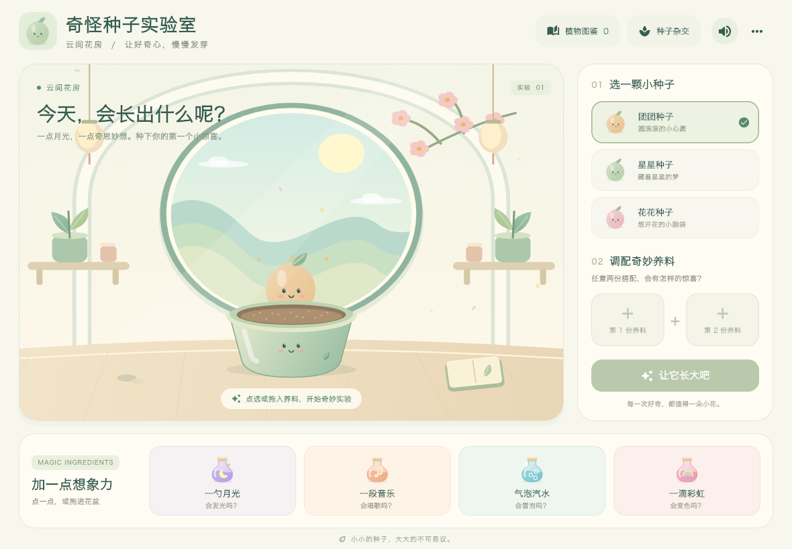
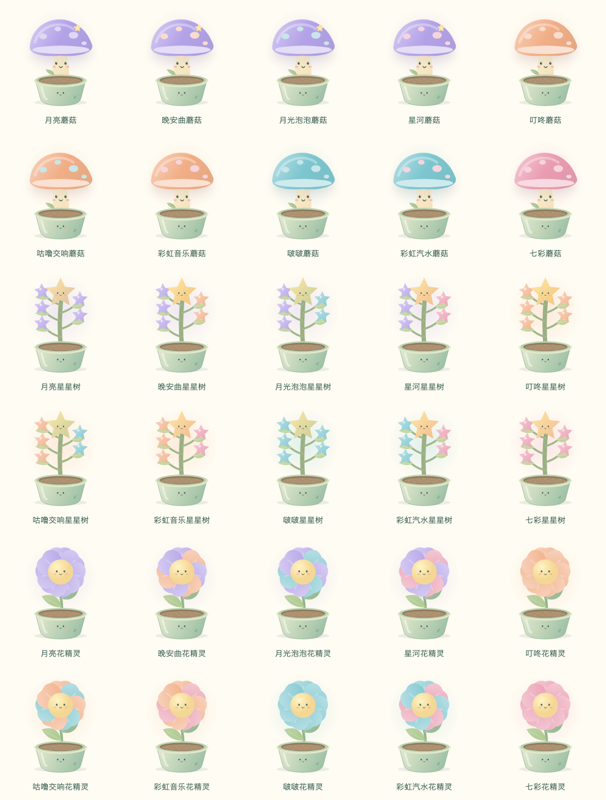
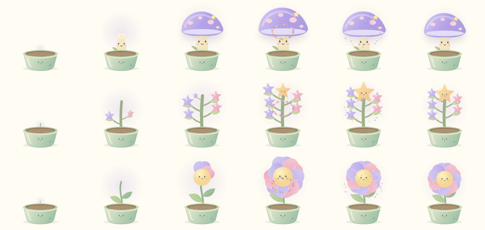
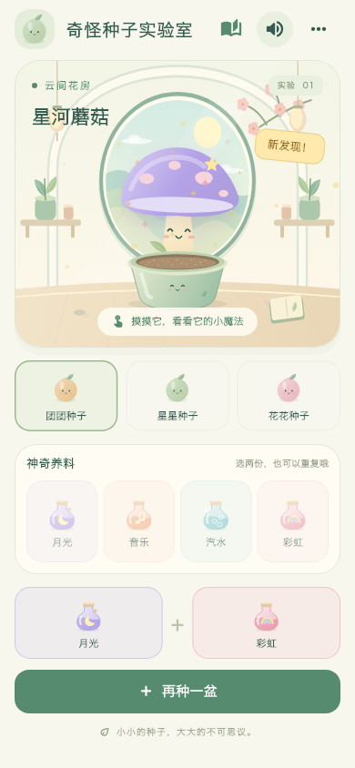
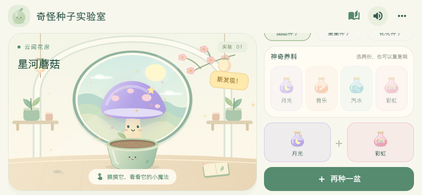

# 奇怪种子实验室 · 云间花房

从山海唤灵师右上角「更多 → 种子花房」进入。原创中国绘本风格：奶油白、青瓷绿、蜜桃粉与淡紫，月洞窗、远山、桃花枝、灯笼和带表情的青瓷花盆。主角是植物精灵，花房与植物使用 Flutter Canvas 实时绘制，可以直接参与动画，放大不依赖位图分辨率。



## 玩法

1. 选择团团、星星或花花种子，对应蘑菇、星星树、花精灵。
2. 点击养料，或把养料瓶拖入花盆。月光、音乐、汽水、彩虹任选两份，允许重复；撤销按钮可以拿走最后一份。
3. 点击「让它长大吧」，观看约 3.8 秒的生长表演。小屏会自动滚回花盆，避免错过动画。
4. 成熟后摸摸植物：弹跳、眯眼、摆动，并出现与配方相符的星光、音符、气泡和彩色粒子。
5. 发现自动收入图鉴，点卡片查看配方并再种一次。两株不同基础植物可杂交成带第二朵花的双生植物；双生植物也会保存。

四种养料的无序二元组合有 10 种，乘以三种形态，共 **30 种基础植物**。相同配方调换加入顺序仍是同一植物、同一外观，不重复增加发现数。杂交使用真实的两位已发现亲本，亲本顺序不影响结果；双生植物不继续杂交，避免组合无限膨胀。



## 动画与声音

- 种子悬浮、花瓣飘落、尘光漂移、自然眨眼、枝叶轻摆。
- 倾斜的养料瓶、连续流动粒子、落入土壤后的光环。
- 蘑菇先伸柄再撑伞；树枝逐个展开并结出星星；花瓣依次绽放，末段弹性回落和粒子庆祝。
- 点按成熟植物触发独立的弹跳与表情。音乐植物有五声音阶短旋律。
- 原创五声音阶背景音乐、成长音阶和发现提示声；中文语音说明每一步，语音播放时压低音乐。
- 「更多 → 轻柔动画」和系统减少动态效果均能降低运动，保留完整结果。后台、图鉴和切换游戏时停止活动动画及声音，返回后从中间进度继续。



| 手机竖屏 | 手机横屏 |
| --- | --- |
|  |  |

## 保存与导航

存档键为 `color_hug.seed_lab.v1`，包含种子、配方、成熟状态、植物图鉴、实验次数与轻柔动画设置。写入串行执行；成长中退出应用，下次恢复为配好养料、可重新唤醒的状态，不会停在无法操作的中间帧。存储或系统音频不可用时仍可游玩。

右上角「更多」进入衣橱；衣橱左上角返回花房，陪伴设置里进入小镇。旧游戏存档不迁移、不清除。

## 运行和产物

```sh
flutter run -d macos
flutter build macos --release --no-pub
```

可试玩 Mac 应用位于 `build/seed-lab-release/奇怪种子实验室.app`，同目录有 `奇怪种子实验室-macOS.zip`。这是本机试玩包，没有做商店发布或公证。

## 验证记录

- `flutter analyze --no-pub`：通过。
- 新实验室、原衣橱与原首页相关测试：35 项通过。
- 新实验室包含配方覆盖、快速重复输入、拖拽、撤销、存档恢复、无效数据、杂交、后台恢复、大字体和减少动画测试。
- 布局测试尺寸：320×568、390×844、844×390、768×1024、1180×820、640×520、800×600。
- `tool/seed_capture_test.dart`：实际 Flutter 画面截图、30 品种总览与三种分段生长关键帧，4 项通过。文档中的截图来自应用绘制，没有用概念图替代游戏。
- macOS release 构建通过，实际应用窗口已启动并检查。
- 未执行 iPhone/iPad 真机帧率、温升及儿童试玩评估。

```sh
flutter test --no-pub test/seed_lab test/dress_up test/widget_test.dart
flutter test --no-pub --update-goldens tool/seed_capture_test.dart
python3 tool/generate_seed_audio.py
```

## 素材与工程

`lib/seed_lab/seed_model.dart` 负责配方、阶段状态、杂交与存档；`seed_art.dart` 绘制背景、精灵和特效；`seed_screen.dart` 负责布局、手势与生命周期；`seed_sound.dart` 管理音乐和音效。音频源代码和来源记录位于 `tool/generate_seed_audio.py`、`assets/seed_lab/audio/SOURCES.md`。

制作时曾尝试内置 imagegen 生成花房背景，但服务返回模型访问权限 403，因此最终未采用 AI 位图，也未调用需要 API 密钥的后备方式。全部视觉为项目内的原创程序绘制。
