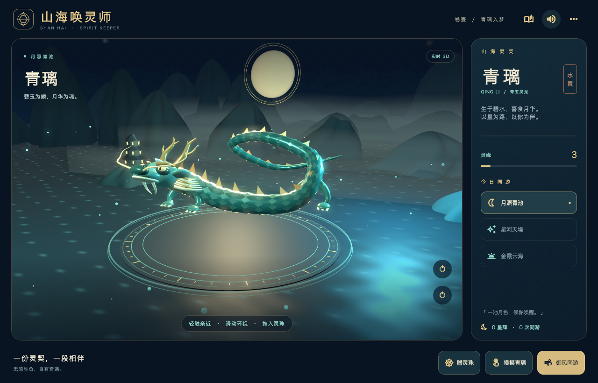
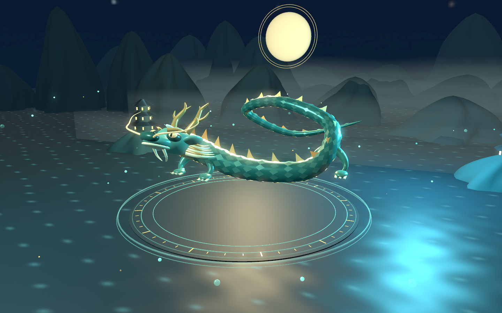
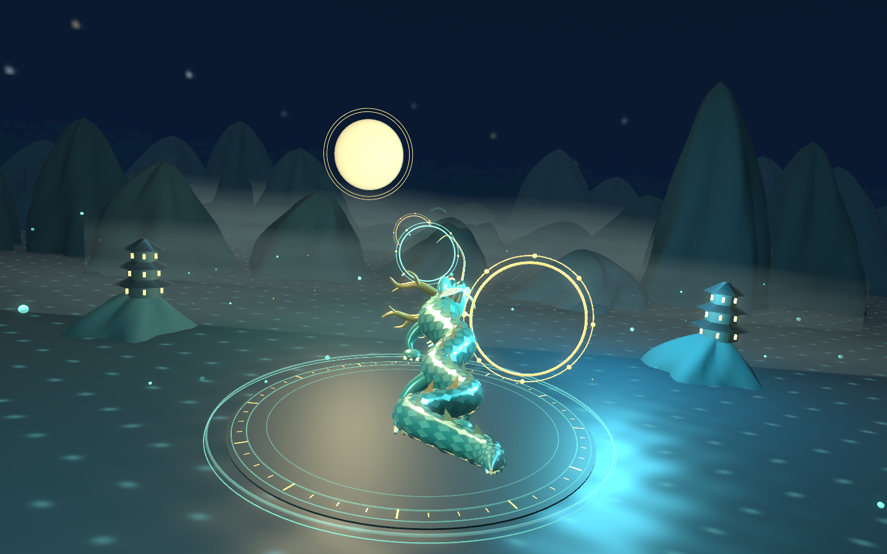
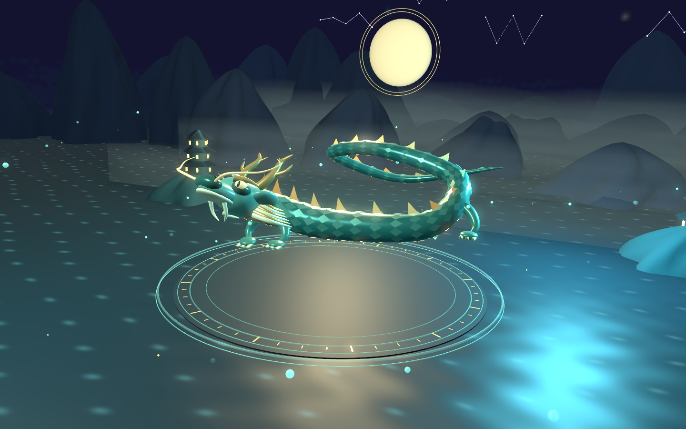
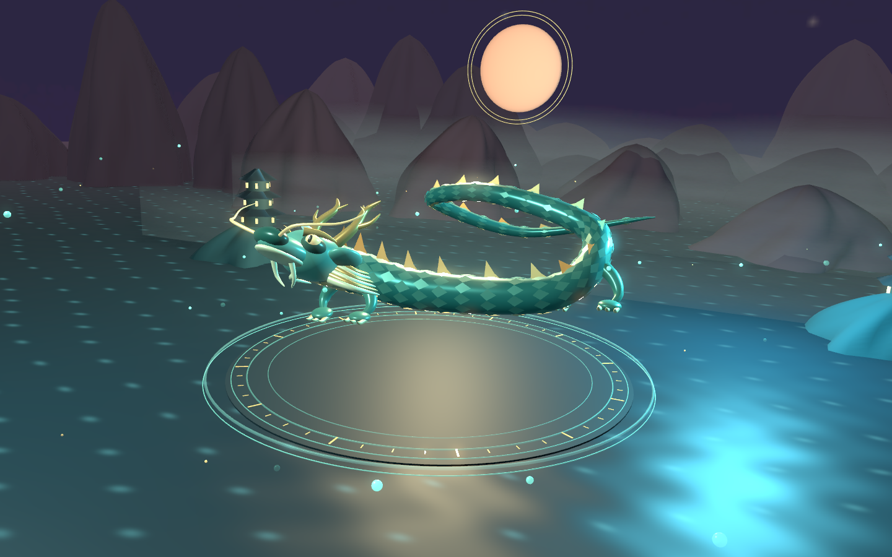

# 山海唤灵师 3D · 青璃入梦

ColorHug 的新默认首页。东方幻想风格的实时 3D 互动游戏，第一位神兽为青玉灵龙「青璃」。深蓝山水、玉石鳞甲、金色龙角、楼阁、薄雾、月轮与水面纹光由 SceneKit / Metal 实时渲染；Flutter 负责手势、灵契、语音和界面。



本页 `ui-*` 图片是布局验收图：Flutter 界面内放置与应用共用源码生成的 SceneKit 快照。正式应用使用实时原生 3D 视口，不使用这些 PNG 当游戏背景。`lake.png`、`flight.png` 等均为同一原生场景的直接 Metal 渲染。

## 已完成玩法

1. **湖面唤醒**：用手指或鼠标划过三个发光灵印，也可逐个点击。光轨跟随手指，三个不同灵印全部点亮后，龙体从水中升起，螺旋流光环绕、鳞甲变亮。可以在更多菜单重温。
2. **结下灵契**：轻点龙所在的舞台或「摸摸青璃」，触发点头与粒子回应；「赠灵珠」支持点击和拖入舞台，灵珠飞向龙首并被吸收，灵缘与赠珠次数保存。
3. **环视青璃**：舞台上横向拖动，或使用左右环视按钮，改变实际 3D 相机角度。固定俯仰与距离，避免进入龙体或地面。
4. **御风同游**：龙身从盘旋展开，镜头平滑切到跟随视角。左右滑动控制方向，或点左右按钮。约 42 秒内穿越七道光环；是否得到星辉由龙首通过光环平面时的横向位置判定。错过不扣分。
5. **归来与收集**：完整飞行后展示本次星辉，返回湖面继续互动。完整飞行次数、总星辉、访问天境与灵缘自动保存。中途返回不算完成旅行。
6. **三种天境**：月照青池、星河天境、金霞云海。天幕、雾色、山色、月轮和星座有实际变化；飞行中固定当前场景，返回后可切换。

| 湖畔青璃 | 跟随飞行 |
| --- | --- |
|  |  |

| 星河天境 | 金霞云海 |
| --- | --- |
|  |  |

## 美术与动画实现

- 连续封闭龙身网格沿三维样条弯曲；鳞片合并为两组几何，龙脊、分叉龙角、龙须、四肢和面部独立建模。
- 龙体起伏、眨眼、龙须摆动、轻触点头、珠光吸收、唤醒升起与飞行变形。
- 真实山体、楼阁、圆形唤灵台和七道空间光环。水面使用动态材质法线与纹光；雾层使用程序生成的透明纹理。
- 物理材质、玉色与金色反光、HDR、柔和泛光和环境遮蔽。当前为原创程序化、风格化 3D 美术，未引入外包雕刻模型或摄影级扫描素材。
- 原创五声音阶氛围音乐和七种短音效；中文系统语音引导，语音期间降低背景音乐。
- 动画支持轻柔模式与系统减少动态效果。进入后台、打开灵契或进入其他游戏时暂停场景、游戏时间及音频，返回继续。

## 平台、运行与试玩包

支持 **macOS、iPhone、iPad** 原生 SceneKit。Android/Web 没有此渲染器，界面明确提示使用 Apple 平台。此版本为单龙完整互动篇章，不包含凤凰、麒麟或多人联机。

```sh
flutter run -d macos
flutter build macos --release --no-pub
flutter build ios --simulator --debug --no-pub
```

Mac 试玩应用：`build/shanhai-release/山海唤灵师.app`；压缩包：`build/shanhai-release/山海唤灵师-macOS.zip`。iOS 模拟器产物：`build/ios/iphonesimulator/Runner.app`。这些是本地构建产物，没有执行 App Store 发布或公证。

右上角「更多 → 种子花房」进入前一款游戏；花房左上角回到山海。花房仍能进入衣橱，衣橱的陪伴设置里进入小镇。旧游戏的内容和存档保留。

## 验证

- 新山海游戏、种子花房、衣橱与原首页相关测试 **52 项通过**，覆盖 320×568、390×844、844×390、640×520、1024×768、1280×820 等尺寸。
- 玩法测试覆盖三枚不同灵印、连续划线、拖动灵珠、重复输入冷却、全部七环可到达、漏环不奖励、中途返航、完整结算、场景切换、坏存档、大字体与暂停恢复。
- 原生 Mac 自动试玩通过：真实 Flutter 指针唤醒、赠珠、抚摸、进入星河、42 秒飞行、打开灵契冻结时间、归来及记录旅程。首次试玩在到达前回到了湖面；第二次带完整阶段记录的验证顺利通过，结果在 `build/shanhai-native/result.json`。
- 同源 SceneKit 渲染 QA 执行 **90 次场景、反应和暂停恢复切换**，检查临时特效节点没有累积。
- 9 项 Flutter 界面截图检查通过；macOS release 与 iOS simulator debug 构建通过。
- 未在 iPhone/iPad 真机测量持续 FPS、温升或电量，也未进行儿童试玩观察。节点回收检查不等于真机性能测试。

```sh
flutter analyze --no-pub
flutter test --no-pub test/shanhai test/seed_lab test/dress_up test/widget_test.dart
xcrun swiftc native/shanhai/ShanhaiScene.swift tool/shanhai_render_qa.swift \
  -o build/shanhai-render -module-cache-path build/shanhai-swift-cache
build/shanhai-render docs/shanhai
flutter test --no-pub --update-goldens tool/shanhai_capture_test.dart
flutter drive --no-pub -d macos --target=tool/shanhai_driver_app.dart \
  --driver=tool/shanhai_driver_test.dart
```

## 工程与存档

`native/shanhai/ShanhaiScene.swift` 定义真实几何、材质、姿态、相机与环境；`ShanhaiPlatformView.swift` 管理 Metal 视图、线程同步、平台通道、渲染时钟和释放。两端 Runner 共用同一套 Swift 文件。

`lib/shanhai/shanhai_model.dart` 管理游戏状态、光环判定与串行存档；`shanhai_screen.dart` 负责布局、输入和生命周期；`shanhai_native.dart` 负责原生桥；`shanhai_sound.dart` 管理音频。

存档键为 `color_hug.shanhai.v1`，记录完成唤醒、灵缘、赠珠次数、完整同游、星辉、访问天境与动画设置。未完成的飞行不在重启后自动结算，重启从已唤醒的湖边继续。存储失败不会阻挡游玩。
