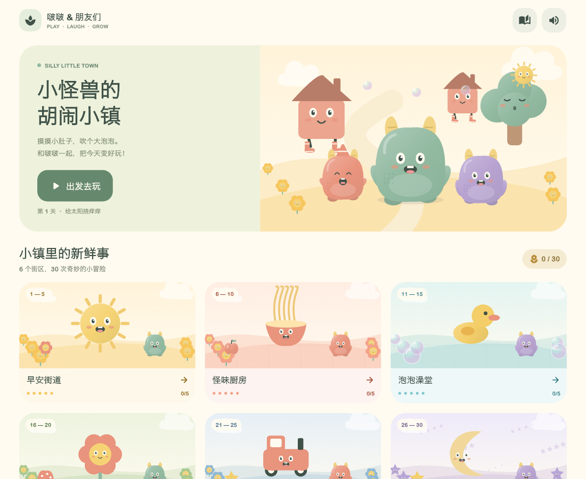
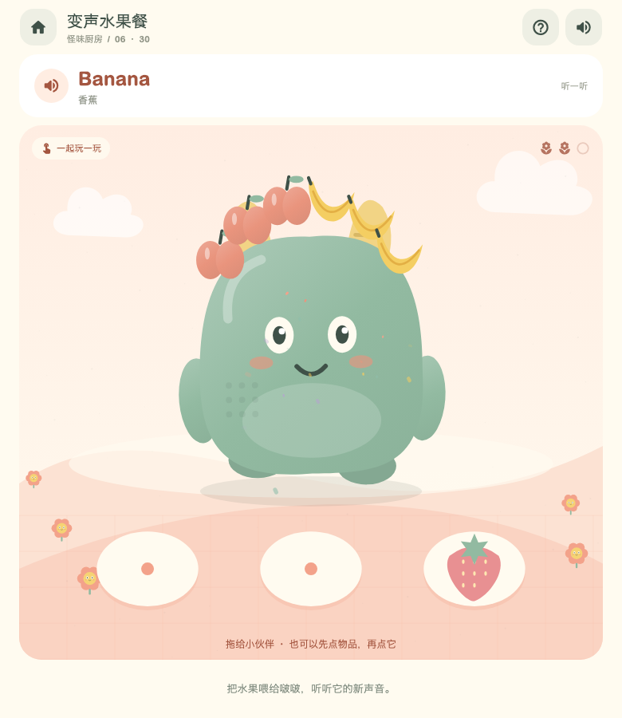
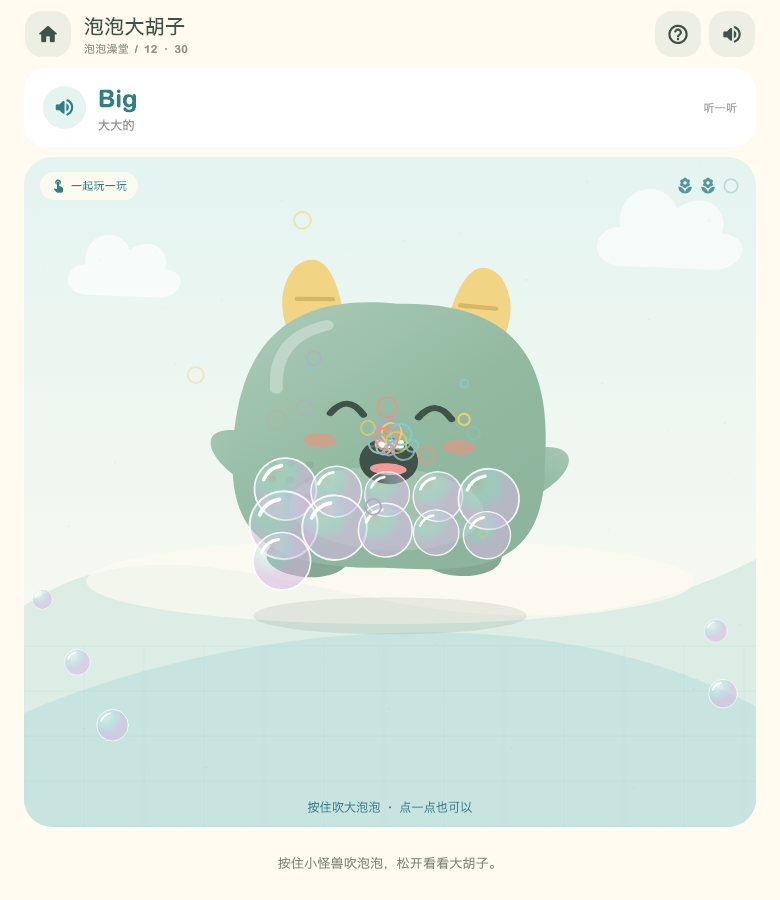

# 小怪兽的胡闹小镇 · Silly Little Town

面向 3–4 岁的轻松触摸游戏。正常启动 `lib/main.dart` 即进入小镇；首页底部可以进入原来的颜色实验室。



## 已实现的内容

- 6 个主题街区、30 个可直接选择的关卡。完成后可重玩，也可继续下一个故事。
- 13 类操作：挠痒痒、送物品、追小玩具、喂食、拉伸、弹跳、装饰、擦洗、长按吹泡泡、浇花、奏乐、开车、哄睡。
- 角色分层绘制：视线跟随、手脚摆动、压扁回弹、呼吸、开心/困倦表情；道具采用相同的柔和绘本配色。
- 喂食有弧线吸附动画和水果头发；太阳有吸气/喷嚏动作和彩虹；泡泡胡子会长大、逐个消散。另有袜子踢踏舞、卷卷面条胡子、飞吐司、动物车厢、鸭子游泳、水滴喷泉、蝴蝶和果冻跳跃。
- 14 个本地原创立体声音频文件：音乐循环、拾取、啵、弹簧、泡泡、笑声、吸溜、咀嚼、水花、木琴、铃铛、拨弦、风铃、庆祝。
- 同时最多 4 个音效声道；音乐在语音期间降低音量。总静音、音乐开关、后台暂停、页面离开时取消语音。
- 本机自动保存通关记录、听过的英语、音乐偏好。不会把“接触过”标成“已经学会”。

## 英语如何出现

每关有 3 个词/短语和 1 句情境句。开场中文指导，接着用独立的 `en-US` 系统音色朗读英文；孩子可以点顶部英语气泡随时重听。拖动物品时说出名称，完成后说情境句。

语速沿用 `GameAudioController` 的英语配置（0.42）；短时间重复操作会限制重复播报，不让多句英语叠在一起。拾取新物品和主动重听优先响应。发音来自设备自带 TTS，不包含真人或云端录音；可用音色、音质取决于设备已安装的英语语音。

首页“小耳朵收藏册”只收录实际提交过播报的词句，不做考试、识字要求、跟读评分或听力达标判断。关闭声音时不把新词记作听过。

| 街区 | 关卡 | 核心语境 |
| --- | --- | --- |
| 早安街道 | 太阳、房子穿鞋、云朵喷嚏、逃跑袜子、早操 | Sun / Shoes / Cloud / Sock / Clap |
| 怪味厨房 | 变声水果、长面条、蹦吐司、布丁、蛋糕火车 | Apple / Long / Up / Pink / Cake |
| 泡泡澡堂 | 洗泥巴、泡泡胡子、小鸭、水管、泡泡飞行 | Wash / Bubble / Duck / Water / Fly |
| 神奇花园 | 哈哈花、蜗牛、毛毛虫、蘑菇乐队、大树 | Grow / Home / One two three / Music / Tree |
| 咕噜车站 | 水果轮子、公交车、动物列车、月亮、小象 | Wheel / Bus / Cat / Moon / Go |
| 睡衣乐园 | 气球、果冻蹦床、旋转动物园、星星、睡衣派对 | Eyes / Jump / Round / Sleep / Good night |

## 低龄操作

物品可直接拖动，也可以先点物品再点角色。吹泡泡可长按，也可多次点按。没有时间压力、错误音或扣分；空白处触摸也有小反馈。闲置约 5 秒出现柔和提示圈。支持系统“减少动态效果”，并限制粒子总量。每关的小演出结束后才显示下一关按钮，保留继续触摸的空间。

游戏尚未进行真实儿童试玩评估。关卡长度取决于孩子探索速度，目前是短互动，可反复玩；不宣称固定 1–2 分钟或已验证教学效果。

## 美术与音频来源

美术是 `lib/silly_town/town_art.dart` 中原创的 Canvas 分层矢量角色和场景，没有使用从其他游戏截取的图片。内置图片生成服务尝试返回了模型权限错误，未产出可用资产，因此本版未引用生成图片。

音效与音乐均由 `tool/generate_town_audio.py` 原创合成，22050 Hz / 16-bit / 双声道，随安装包离线提供；8 小节、88 BPM 的木琴/拨弦音乐可以循环。音频再生成：

```sh
python3 tool/generate_town_audio.py
```

## 运行与验证

```sh
flutter run -d macos
flutter analyze --no-pub
flutter test test/silly_town --no-pub
flutter test --update-goldens tool/town_capture_test.dart
flutter drive -d macos --target tool/town_driver_app.dart --driver tool/town_driver_test.dart
```

Flutter 的截图任务和单元测试共用 `build/unit_test_assets`，请串行运行。截图脚本读取 macOS 系统字体；CI 或其他系统需换成可用字体。Native driver 使用独立内存存档，通过正常的命中测试派发指针事件，不直接设置过关状态。

测试覆盖 30 关完成、真实 widget 手势、320×568 / 390×844 / 844×390 / 1024×768 布局、两次点按替代拖动、取消/多指/后台暂停、损坏存档、去重和重启恢复。原生入口另检查太阳、喂水果、长按泡泡及英语语言切换。iPhone/iPad 真机音色、触感和性能仍需在对应设备检查。

## 文件

- `town_catalog.dart`：关卡、场景与中英文内容。
- `town_model.dart`：命中测试、操作、通关和粒子状态。
- `town_art.dart`：角色、道具、背景和演出。
- `town_screen.dart`：首页、街区、词句收藏册与游戏页面。
- `town_audio.dart`：音乐、音效、语音协调。
- `town_progress.dart`：独立版本化存档。



